# Perbaikan UI/UX mobile 2026-09-30 — bukti before/after

- **Sebelum:** `10e35b62` (fix(kajian): keep chunk ids stable when a video is in two channel files), kode `apps/mobile` sebelum kelima perbaikan di bawah
- **Sesudah:** `b2d06fdd` (docs(reviews): deep audit of the Ibadah feature), semua perbaikan sudah termuat
- **Lingkungan:** Expo web export (`apps/mobile`) di Chromium lewat Playwright dengan jendela terlihat, iPhone 15 Pro Max (430x739 @2x), tema terang
- **Data:** 01–04 memakai API produksi (konten publik, tanpa login). 05–07 memakai API lokal `localhost:29900` dan akun admin seeder lokal, karena butuh data personal dan daftar kosong
- **Aturan yang mengikat:** [`docs/VISUAL_EVIDENCE.md`](../../../VISUAL_EVIDENCE.md)

| #   | Layar                                   | Yang diperbaiki                                    | Commit                     |
| --- | --------------------------------------- | -------------------------------------------------- | -------------------------- |
| 01  | Tab Al-Quran setelah Belajar > Kajian   | Header bocor antar-tab, daftar surah tidak termuat | `ac0bfb82`                 |
| 02  | Pembaca surah setelah Belajar > Asbabun | Header bocor antar-tab                             | `ac0bfb82`                 |
| 03  | Hadis > Buka Reader                     | Daftar tidak dimuat setelah memilih kitab          | `e0a3e138`                 |
| 04  | Belajar > Kajian, kartu ringkasan       | Angka dihitung dari satu halaman, bukan total      | `724158c9`                 |
| 05  | Belajar > Bookmark                      | Judul mentah ("hadith 1", "ayah 2149")             | `b2efb387`, tes `995dd532` |
| 06  | Belajar > Catatan                       | Judul mentah ("hadith 1", "ayah 2149")             | `b2efb387`, tes `995dd532` |
| 07  | Belajar > Kajian dengan daftar kosong   | Kartu palsu "Item 1" dan statistik 1 / 0 / 0       | `9c28b2ea`                 |

## 01 — Tab Al-Quran setelah membuka Belajar > Kajian

Sebelumnya header tetap bertuliskan "Kajian" lengkap dengan tombol kembali, dan spinner daftar surah masih berputar setelah 15 detik. Sekarang header kembali ke header bawaan aplikasi (logo dan nama aplikasi) dan daftar surah termuat.

| Before                                                               | After                                                               |
| -------------------------------------------------------------------- | ------------------------------------------------------------------- |
| 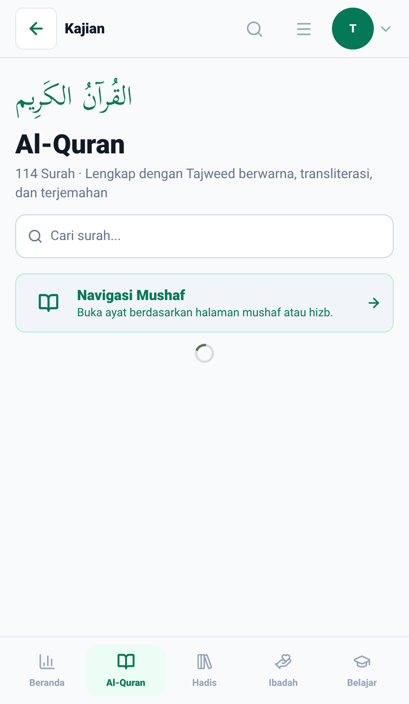 | 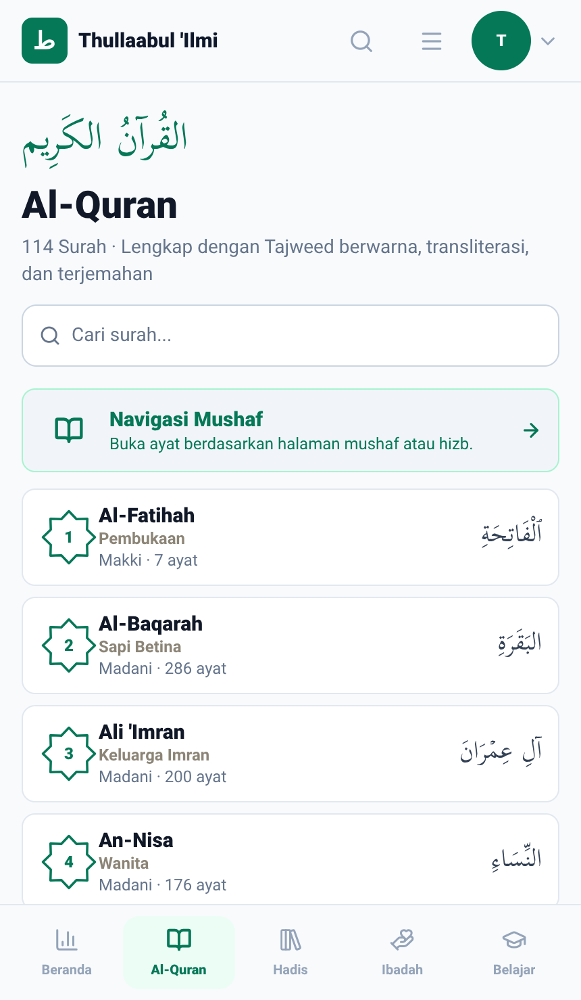 |

## 02 — Pembaca surah Al-Kahf setelah membuka Belajar > Asbabun Nuzul

Sebelumnya header pembaca surah masih bertuliskan "Asbabun Nuzul" padahal yang terlihat adalah surah Al-Kahf. Sekarang header menampilkan nama surah dan jumlah ayatnya.

| Before                                                                   | After                                                                   |
| ------------------------------------------------------------------------ | ----------------------------------------------------------------------- |
| 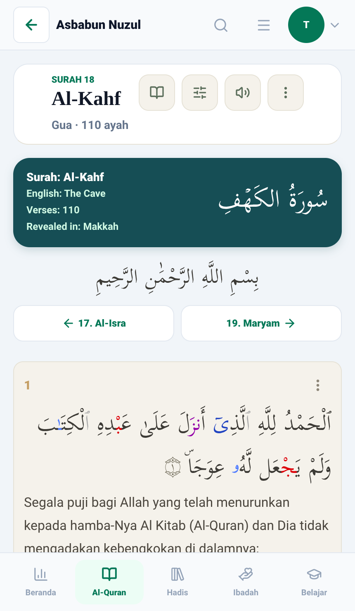 | 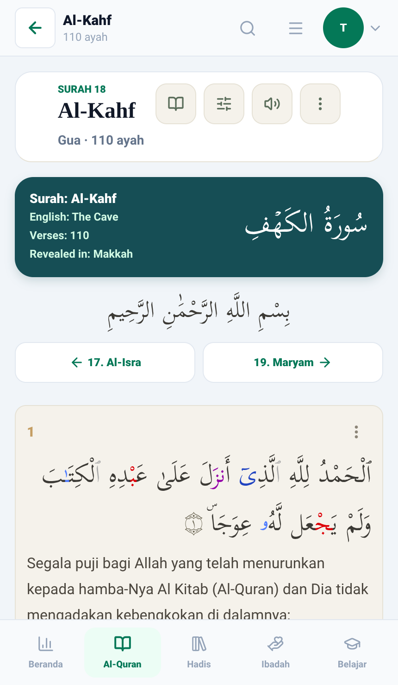 |

## 03 — Hadis > Buka Reader pada sebuah kitab

Sebelumnya judul sudah "Shahih Bukhari" tetapi status tetap "Memuat hadis…" dan baris yang tampil masih sisa kitab lain (Sunan Abu Daud). Sekarang daftar Shahih Bukhari langsung termuat: "20 hadis ditampilkan dari 7.563 hadis".

| Before                                                    | After                                                    |
| --------------------------------------------------------- | -------------------------------------------------------- |
| 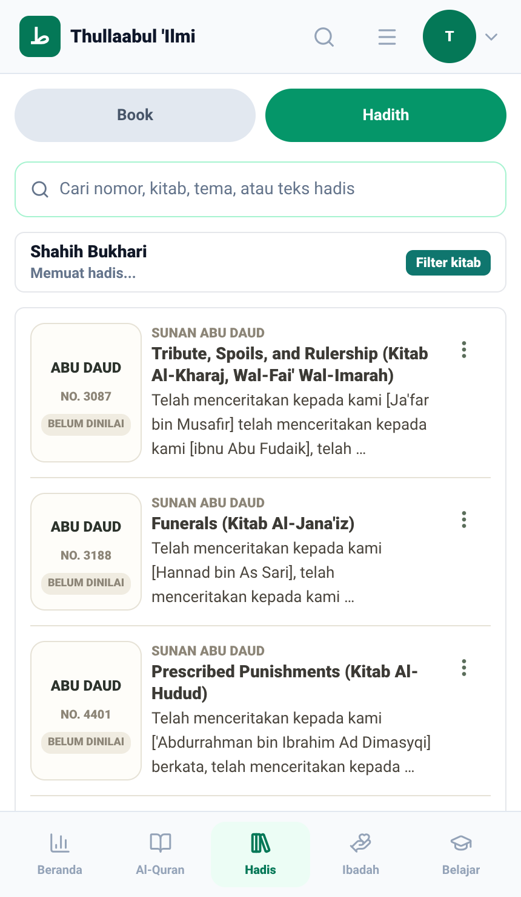 | 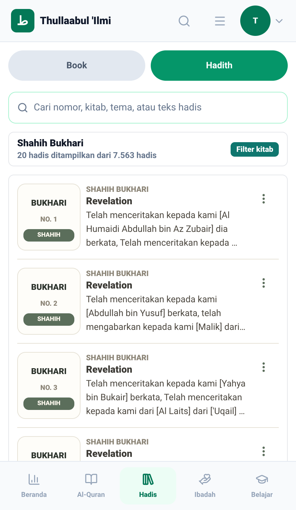 |

## 04 — Belajar > Kajian, kartu ringkasan

Sebelumnya angka dihitung dari 20 item yang baru dimuat (20 / 20 / 9). Sekarang memakai total dari API (7.346 kajian, 7.346 video, 10 kategori). Angkanya mengikuti data produksi saat gambar diambil.

| Before                                                    | After                                                    |
| --------------------------------------------------------- | -------------------------------------------------------- |
| 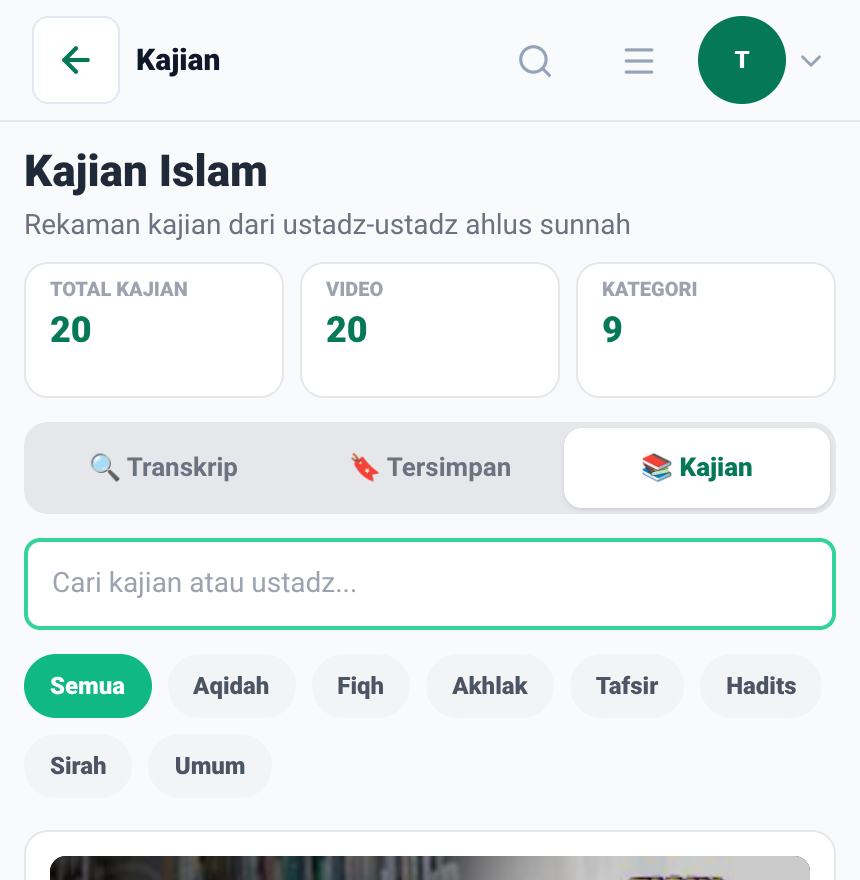 | 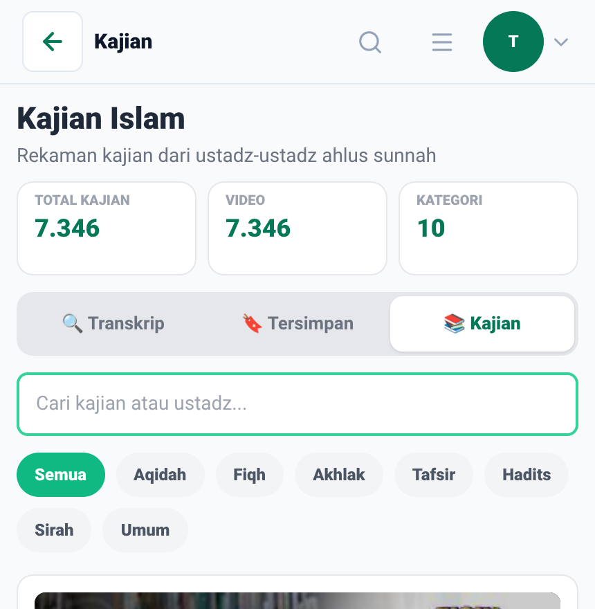 |

## 05 — Belajar > Bookmark

Sebelumnya kartu hanya berjudul referensi mentah ("hadith 1", "ayah 2149") tanpa isi. Sekarang berjudul "Sunan Abu Daud No. 3087" dan "Al-Kahf · Ayat 9" dengan cuplikan teksnya.

| Before                                                  | After                                                  |
| ------------------------------------------------------- | ------------------------------------------------------ |
| 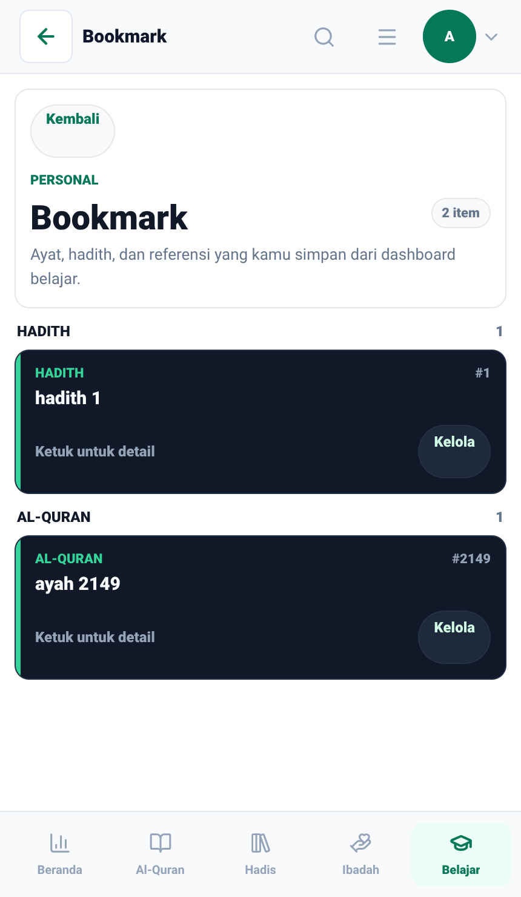 | 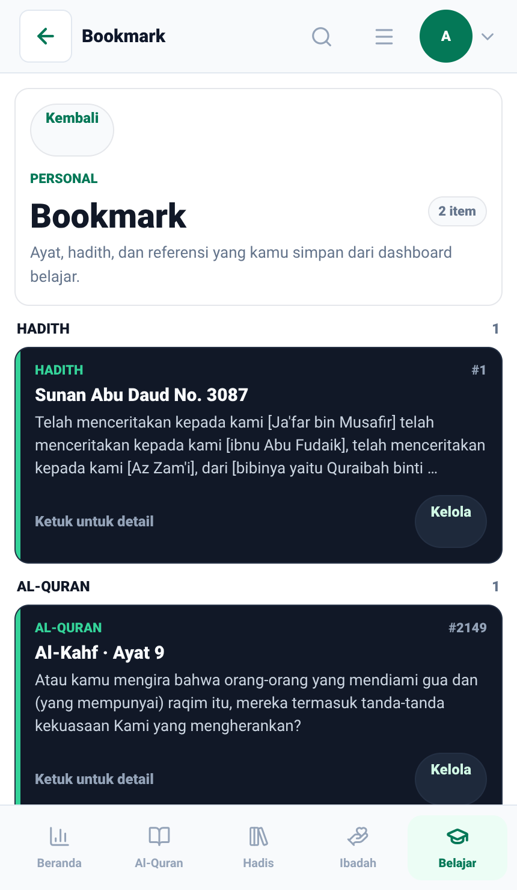 |

## 06 — Belajar > Catatan

Sama seperti Bookmark: judul kartu catatan kini terbaca, isi catatan tetap sama.

| Before                                                 | After                                                 |
| ------------------------------------------------------ | ----------------------------------------------------- |
| 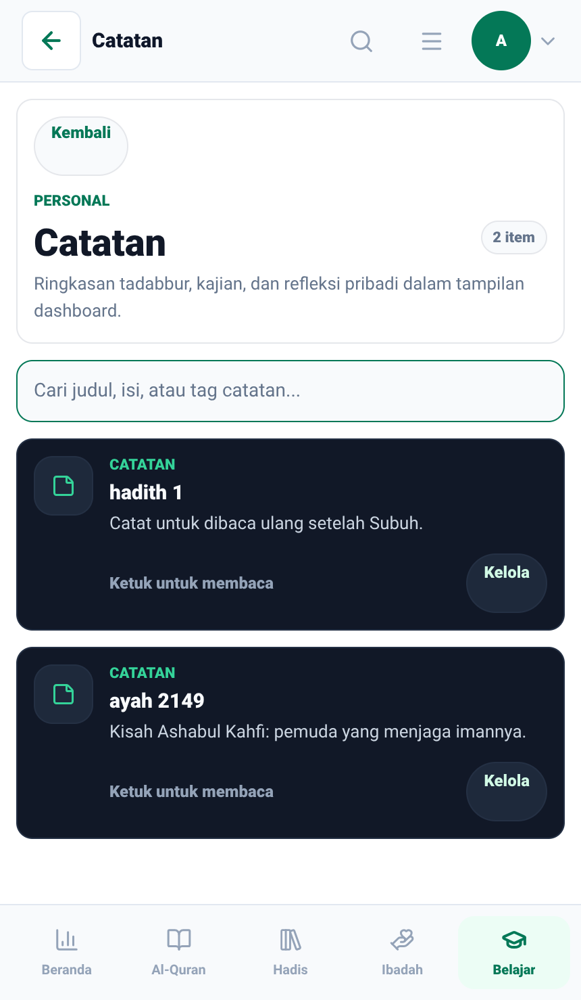 | 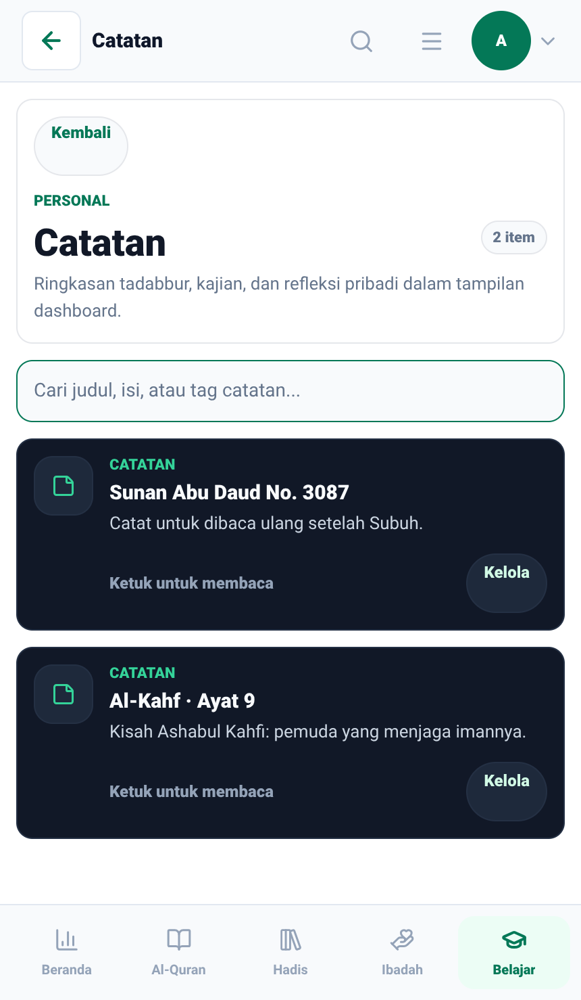 |

## 07 — Belajar > Kajian dengan daftar kosong

Saat API mengembalikan `items: null`, sebelumnya muncul satu kartu palsu "Item 1" dan statistik 1 / 0 / 0. Sekarang muncul empty state "Kajian tidak ditemukan." dan statistik 0 / 0 / 0. Diambil di API lokal, yang daftar kajiannya hampir kosong.

| Before                                                    | After                                                    |
| --------------------------------------------------------- | -------------------------------------------------------- |
| 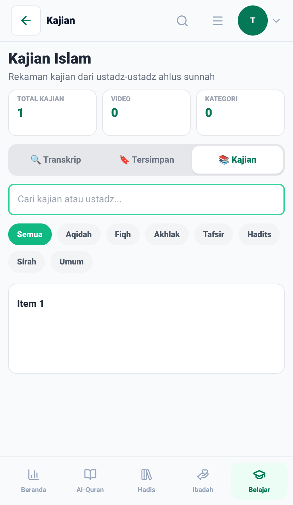 | 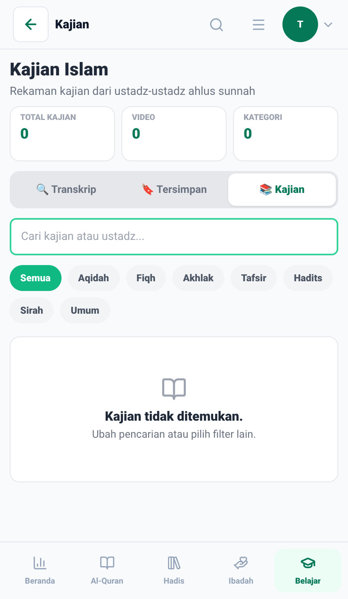 |

## Catatan

- Kode di `b2efb387` untuk nomor 05 dan 06 ikut tersapu commit sesi lain yang pesannya tentang Go; isinya tetap perbaikan judul Bookmark/Catatan, dan tesnya ada di `995dd532`.
- 05 dan 06 memakai akun admin seeder lokal dan data uji (dua bookmark, dua catatan) yang dibuat lewat API lalu dihapus otomatis oleh `capture.js`. Tidak ada data pengguna sungguhan.
- Login di web export butuh penambal `expo-secure-store` yang hanya dipasang saat pengambilan gambar (lihat [`scripts/demo-recording/README.md`](../../../../scripts/demo-recording/README.md)); kode aplikasi tidak diubah.
- Kartu gelap di Bookmark dan Catatan adalah gaya yang sudah ada, bukan bagian perbaikan ini.

## Cara mengambil ulang

Server Expo dan browser berjalan terlihat di depan, server mati sendiri setelah `capture.js` selesai. Cara mendapatkan kredensial admin seeder ada di [`scripts/demo-recording/README.md`](../../../../scripts/demo-recording/README.md); stack docker lokal harus menyala untuk 05–07.

```bash
scripts/before-after/export-revision.sh 10e35b62 /tmp/ba-before
scripts/before-after/export-revision.sh b2d06fdd /tmp/ba-after

export DEMO_LOGIN_IDENTIFIER=admin@tholabul-ilmi.com
export DEMO_LOGIN_PASSWORD='<admin password>'

HEADED=1 PORT=19011 LABEL=before OUT_DIR=/tmp/ba-shots \
  scripts/before-after/run-with-expo.sh /tmp/ba-before 19011 \
  node docs/media/before-after/2026-09-30-mobile-ui-fixes/capture.js

HEADED=1 PORT=19012 LABEL=after OUT_DIR=/tmp/ba-shots \
  scripts/before-after/run-with-expo.sh /tmp/ba-after 19012 \
  node docs/media/before-after/2026-09-30-mobile-ui-fixes/capture.js
```

Tanpa `OUT_DIR`, hasilnya menimpa gambar di folder ini. `ONLY=01,03` menjalankan sebagian skenario saja.
