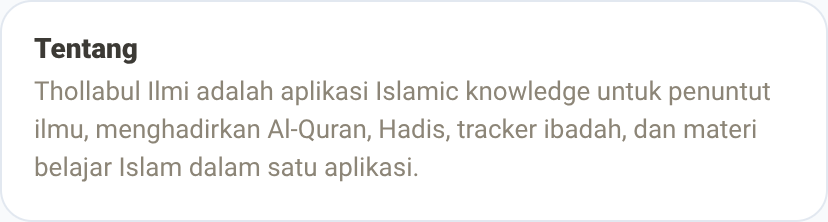
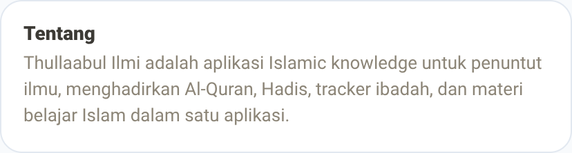
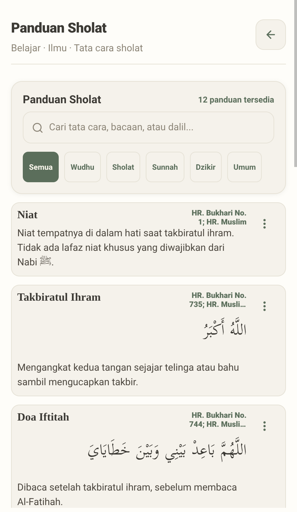
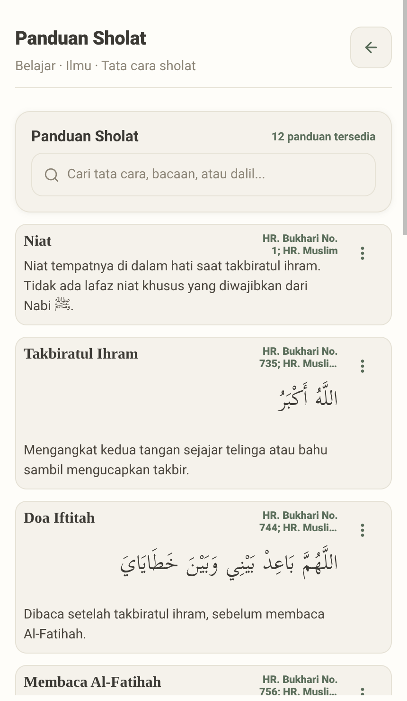
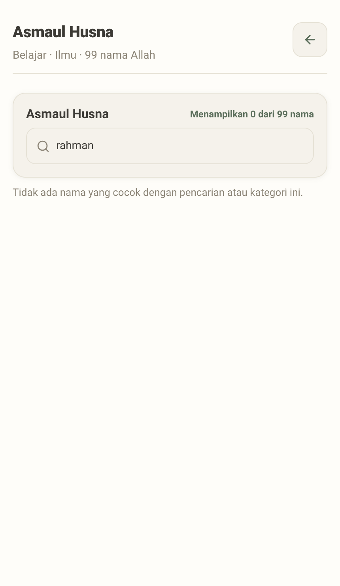
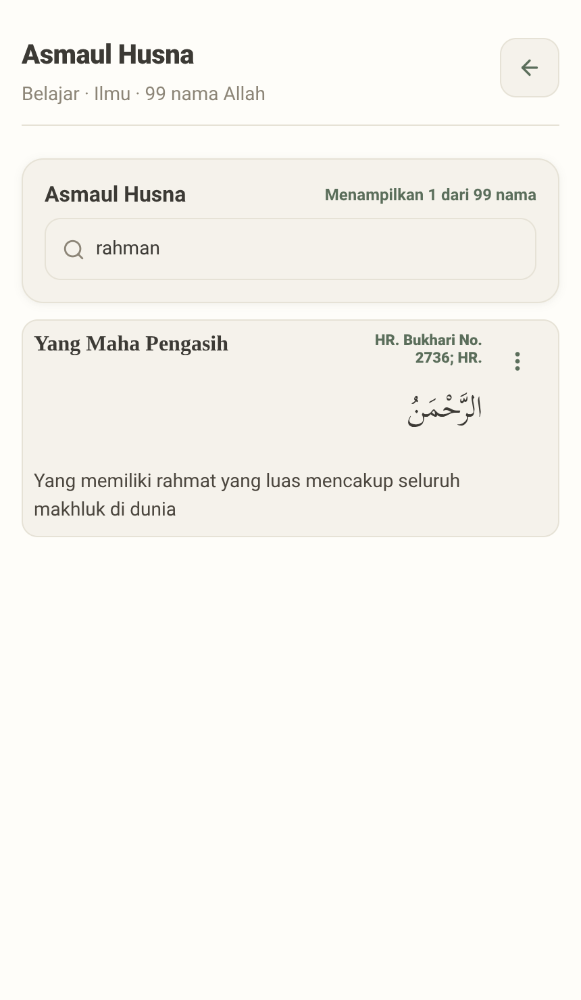

# Perbaikan B17–B19 Belajar Hub (lanjutan sesi 5) — bukti before/after

- **Topik:** 3 perbaikan dari sesi 5 audit Belajar hub (B17 residual app-name
  spelling, B18 chip kategori mati di Panduan Sholat, B19 transliterasi tidak
  terindeks di pencarian Asmaul Husna). Lihat
  [`docs/reviews/2026-10-01-belajar-hub-deep-audit.md`](../../../reviews/2026-10-01-belajar-hub-deep-audit.md)
  bagian "Status Perbaikan — Sesi 5". Folder ini melengkapi
  [`2026-10-01-belajar-hub-code-fixes/`](../2026-10-01-belajar-hub-code-fixes/README.md)
  (B10–B16) dengan kode fix selanjutnya — namanya dapat suffix `-2` supaya
  tidak bentrok dengan folder itu.
- **Sebelum:** `8fe9eb61` (docs(reviews): live-confirm B10-B16, record B17-B20
  found during verification).
- **Sesudah:** `2d3ea736` — `HEAD` saat pengambilan. Mencakup commit perbaikan
  `27c9801a` (B17) dan `fbfda767` (B18, B19), plus dua commit tak terkait yang
  numpang lewat di antara keduanya dan `HEAD` (`8b0a6be6` docs-only,
  `2e90e27e` historical map, `2d3ea736` web/api) — tidak menyentuh layar yang
  difoto di sini.
- **⚠️ Penyimpangan dari SHA yang disarankan brief tugas ini:** brief awal
  menyebut `5c5c0a44` sebagai revisi "sebelum" untuk ketiga bug (B17, B18,
  B19). Verifikasi `git log --oneline 5c5c0a44..HEAD` (persis seperti yang
  diminta brief) menunjukkan hanya `27c9801a` (B17) yang muncul di rentang
  itu — `fbfda767` (B18, B19) **tidak ada**. Penelusuran lebih lanjut
  (`git show -s --format='%P' 5c5c0a44` dan `fbfda767^`) membuktikan
  `fbfda767` justru **parent langsung** dari `5c5c0a44`
  (urutan commit sebenarnya: `fbfda767` → `5c5c0a44` (B20) → `27c9801a`
  (B17) → ... → `HEAD`). Artinya `5c5c0a44` **sudah** mengandung fix B18/B19
  — memotretnya sebagai "before" untuk pasangan 03 dan 04 akan menghasilkan
  bukti palsu (kedua pasang akan menampilkan perilaku yang **sudah benar**,
  bukan bug lama). Dipakai sebagai gantinya: `8fe9eb61`, parent langsung
  `fbfda767`, yakni commit tertua yang masih mendahului ketiga fix (B17 **dan**
  B18 **dan** B19) sekaligus — dikonfirmasi dengan membaca isi
  `idn.js`/`referenceListFilter.js` langsung di revisi itu (lihat per-bagian
  di bawah). Satu revisi "before" ini dipakai untuk keempat pasang, konsisten
  dengan model before/after tunggal di `VISUAL_EVIDENCE.md`.
- **Lingkungan:** Expo web export (`apps/mobile`) di Chromium lewat
  Playwright dengan jendela terlihat (`HEADED=1`), iPhone 15 Pro Max
  (430×932 @2x). API produksi untuk semua pasang (konten publik, tanpa
  login, tamu/guest). Bahasa Indonesia (default), tema terang (default).
  Mode layout: pasang 01–02 memakai mode default saat fresh-load (tidak
  diubah); pasang 03–04 eksplisit berpindah ke **Classic** lewat
  Profil → Pengaturan → Tampilan (konsisten dengan pasangan 06 di folder
  B10–B16, yang juga memotret fitur reference-list Classic). Fix B18/B19
  berlaku sama di layout Modern (Web App) — lihat pesan commit `fbfda767` —
  tapi tidak difoto ulang di sana untuk menjaga jumlah pasang tetap minimal.
- **B20 sengaja TIDAK disertakan di sini.** B20 adalah race kondisi timing
  keyboard Android asli (`keyboardVisible` tersangkut `true` karena
  `ExploreScreen` membongkar native view kolom pencarian sebelum event
  `keyboardDidHide` terkirim) — tidak punya padanan di browser (Expo web
  tidak mensimulasikan soft keyboard Android maupun urutan event
  `keyboardDidHide`/native-view teardown-nya). Sesi live-verify terpisah di
  emulator Android asli menangani buktinya.

| #   | Layar                                                   | Yang diperbaiki                                                                                         | Commit     |
| --- | ------------------------------------------------------- | ------------------------------------------------------------------------------------------------------- | ---------- |
| 01  | Profil > Tentang Aplikasi                               | B17: paragraf deskripsi "Thollabul Ilmi" → "Thullaabul Ilmi"                                            | `27c9801a` |
| 02  | Profil > Pengaturan > Tampilan, opsi tema "Terang"      | B17: meta opsi tema "Palet terang klasik Thullabul Ilmi." → "...Thullaabul Ilmi."                       | `27c9801a` |
| 03  | Classic > Belajar > Ilmu > Panduan Sholat               | B18: chip kategori mati (Semua/Wudhu/Sholat/Sunnah/Dzikir/Umum) dihapus — API tak pernah kirim kategori | `fbfda767` |
| 04  | Classic > Ibadah > Bacaan > Asmaul Husna, cari "rahman" | B19: transliterasi ("Ar-Rahman") kini ikut terindeks pencarian, bukan cuma arti Indonesia               | `fbfda767` |

## 01 — Profil > Tentang Aplikasi

B10 (sesi 4) sudah membetulkan 3 lokasi ejaan nama app, tapi paragraf
deskripsi di layar "Tentang Aplikasi" terlewat dan masih memakai ejaan lama.
Sebelumnya: "**Thollabul** Ilmi adalah aplikasi...". Sekarang: "**Thullaabul**
Ilmi adalah aplikasi...", menyamai `profile.about.appName` yang sudah benar
sejak B10.

| Before                                                 | After                                                 |
| ------------------------------------------------------ | ----------------------------------------------------- |
|  |  |

## 02 — Profil > Pengaturan > Tampilan, opsi tema "Terang"

Celah residual B10 yang sama, di teks meta opsi tema terang. Sebelumnya:
"Palet terang klasik **Thullabul** Ilmi." (tanpa huruf "a" kedua). Sekarang:
"Palet terang klasik **Thullaabul** Ilmi.".

| Before                                                   | After                                                   |
| -------------------------------------------------------- | ------------------------------------------------------- |
|  |  |

## 03 — Classic > Belajar > Ilmu > Panduan Sholat

Kategori Panduan Sholat (Wudhu/Sholat/Sunnah/Dzikir/Umum) di-hardcode seolah
API menandai tiap langkah dengan kategori — dikonfirmasi lewat curl bahwa
`/api/v1/panduan-sholat` tidak pernah mengirim `category`/`jenis_nilai`/
`type`/`occasion` pada item manapun, jadi setiap chip selain "Semua" selalu
cocok nol langkah (chip mati/menipu). Sebelumnya: chip row tampil di bawah
search box, di atas daftar langkah. Sekarang: daftar kategori dikosongkan
(sama seperti pola `asmaul-husna` yang sudah `categories: []`) sampai API
beneran mengirim field kategori — chip row tidak dirender sama sekali,
daftar langkah langsung mulai setelah search box.

| Before                                                       | After                                                       |
| ------------------------------------------------------------ | ----------------------------------------------------------- |
|  |  |

## 04 — Classic > Ibadah > Bacaan > Asmaul Husna, cari "rahman"

Title tiap item Asmaul Husna berasal dari `translation.idn` (arti Indonesia,
mis. "Yang Maha Pengasih"), bukan dari field transliterasi API
(`raw.transliteration`, mis. "Ar-Rahman") — jadi haystack pencarian yang
dibangun dari title/body/arabic/meta tidak pernah melihatnya. Sebelumnya:
mengetik "rahman" di search box menghasilkan "Menampilkan 0 dari 99 nama" dan
pesan "Tidak ada nama yang cocok dengan pencarian atau kategori ini." —
walau nama itu ada (Ar-Rahman/Yang Maha Pengasih termasuk di antara 99 nama).
Sekarang: `transliteration`/`indonesian`/`english` ditambahkan ke haystack
pencarian, pencarian yang sama menghasilkan "Menampilkan 1 dari 99 nama" dan
menampilkan kartu "Yang Maha Pengasih" (Ar-Rahman). Perubahan ini hanya
memengaruhi apa yang bisa dicari, bukan apa yang ditampilkan di kartu (title
kartu tetap arti Indonesia seperti sebelumnya) — berlaku sama di kedua
layout (Classic maupun Modern/Web App), dikonfirmasi lewat pembacaan kode
yang sama di `fbfda767`.

| Before                                                      | After                                                      |
| ----------------------------------------------------------- | ---------------------------------------------------------- |
|  |  |

## Catatan

- Pasangan 01 dan 02 di-crop ke kartu/baris yang relevan saja (lewat
  `locator.screenshot()` pada elemen Card/baris, bukan `clip` koordinat
  piksel) supaya beda satu-huruf ("Thollabul"/"Thullabul" vs "Thullaabul")
  tetap terbaca jelas pada lebar tampil 320px di README — screenshot
  viewport penuh (430px) akan menyusutkan teks ini sampai nyaris tak
  terbaca saat diskalakan ke 320px.
- Pasangan 03 dan 04 memakai satu viewport penuh tanpa crop (konsisten
  dengan konvensi "daftar homogen cukup satu viewport" di
  `VISUAL_EVIDENCE.md`); keduanya butuh prasyarat state (mode layout
  Classic) yang diatur `capture.js` sendiri sebelum screenshot.
- Tidak ada login/akun pribadi yang dipakai — semua pasang memakai API
  produksi sebagai tamu (guest), konten publik.
- Semua PNG dilihat langsung (bukan ditebak dari log) sebelum dianggap
  selesai; tidak ada spinner/layar kosong/login gagal.

## Cara mengambil ulang

Server Expo dan browser berjalan terlihat di depan, berhenti sendiri setelah
`capture.js` selesai. `run-with-expo.sh` `cd` ke folder ekspor sebelum
menjalankan perintah, jadi path ke `capture.js` di bawah **harus absolut**
(pelajaran dari folder B10–B16, bukan path relatif seperti contoh umum di
`VISUAL_EVIDENCE.md`).

```bash
scripts/before-after/export-revision.sh 8fe9eb61 /tmp/ba2-before
scripts/before-after/export-revision.sh HEAD /tmp/ba2-after

HEADED=1 PORT=19015 LABEL=before OUT_DIR=/tmp/ba2-shots \
  scripts/before-after/run-with-expo.sh /tmp/ba2-before 19015 \
  node "$(pwd)/docs/media/before-after/2026-10-01-belajar-hub-code-fixes-2/capture.js"

HEADED=1 PORT=19016 LABEL=after OUT_DIR=/tmp/ba2-shots \
  scripts/before-after/run-with-expo.sh /tmp/ba2-after 19016 \
  node "$(pwd)/docs/media/before-after/2026-10-01-belajar-hub-code-fixes-2/capture.js"
```

Tanpa `OUT_DIR`, hasilnya menimpa gambar di folder ini. `ONLY=01,03`
menjalankan sebagian skenario saja (nomor di depan nama file). Pilih port
bebas (`lsof -iTCP:<port> -sTCP:LISTEN`) — sesi lain mungkin memakai
`19011`–`19014`.
