# Perbaikan B10–B16 Belajar Hub & Chrome — bukti before/after

- **Topik:** Audit sesi 4 Belajar hub & navigasi (B10 app name, B11 toggle
  ID/EN, B12 tab Belajar "nyangkut", B13 kontras label dark mode, B14
  search/filter Classic, B15 tombol tutup Global Search, B16 highlight
  hamburger "Lainnya"). Lihat
  [`docs/reviews/2026-10-01-belajar-hub-deep-audit.md`](../../../reviews/2026-10-01-belajar-hub-deep-audit.md)
  bagian "Status Perbaikan — Sesi 4".
- **Sebelum:** `95295da8` (fix(mobile): debounce reference-list search to stop
  a real ANR, fix Doa header label) — commit terakhir sebelum B10–B16 ada.
- **Sesudah:** `b1af0331` (docs(reviews): close out B10-B16, record the
  ExploreScreen state gotcha) — `HEAD` saat pengambilan, mencakup keempat
  commit perbaikan: `a9111a9b` (B15), `ae704030` (B12), `6ca564a0` (B10, B11,
  B13, B16), `84d30cbe` (B14).
- **Lingkungan:** Expo web export (`apps/mobile`) di Chromium lewat
  Playwright dengan jendela terlihat, iPhone 15 Pro Max (430x932 @2x). API
  produksi untuk semua pasang (konten publik, tanpa login). Tema/bahasa/mode
  layout berbeda per pasang — dicatat di tabel dan tiap bagian di bawah.
- **Aturan yang mengikat:** [`docs/VISUAL_EVIDENCE.md`](../../../VISUAL_EVIDENCE.md)

| #   | Layar                                       | Yang diperbaiki                                                                         | Commit     |
| --- | ------------------------------------------- | --------------------------------------------------------------------------------------- | ---------- |
| 01  | Header atas (Beranda)                       | B10: nama app 3 ejaan berbeda → satu konstanta `APP_NAME`                               | `6ca564a0` |
| 02  | Hadis > daftar kitab (bahasa Indonesia)     | B11: toggle "Book"/"Hadith" hardcode Inggris → `t()` jadi "Kitab"/"Hadis"               | `6ca564a0` |
| 03  | Belajar hub, hero (bahasa Inggris)          | B11: hero hardcode "KONTEN ISLAM"/"Belajar" → ikut `t()` jadi "ISLAMIC CONTENT"/"Learn" | `6ca564a0` |
| 04  | Ibadah > Doa, lalu tap tab Belajar          | B12: tab Belajar "nyangkut" di konten Doa, cuma highlight yang pindah                   | `ae704030` |
| 05  | Profil > Pengaturan > Tampilan (tema gelap) | B13: label "Tema"/"Bahasa Konten" gelap-di-atas-gelap, nyaris tak terbaca               | `6ca564a0` |
| 06  | Classic > Ibadah > Dzikir                   | B14: Classic tanpa search box/chip kategori/counter untuk 8 fitur list                  | `84d30cbe` |
| 07  | Beranda > ikon pencarian (Pencarian Global) | B15: tidak ada tombol tutup selain back fisik                                           | `a9111a9b` |
| 08  | Profil > Pengaturan, lalu buka hamburger    | B16: grup "LAINNYA" — 3 baris aktif sekaligus, bukan cuma yang dibuka                   | `6ca564a0` |

## 01 — Header atas (Beranda)

Sebelumnya nama app tertulis "Thullaabul 'Ilmi" (pakai apostrof) di header
Modern. Sekarang satu konstanta `APP_NAME` dipakai di header dan Profil:
"Thullaabul Ilmi".

| Before                                                  | After                                                  |
| ------------------------------------------------------- | ------------------------------------------------------ |
| 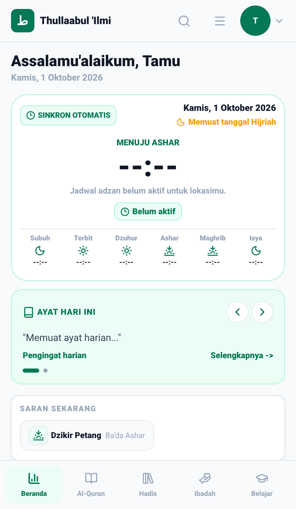 | 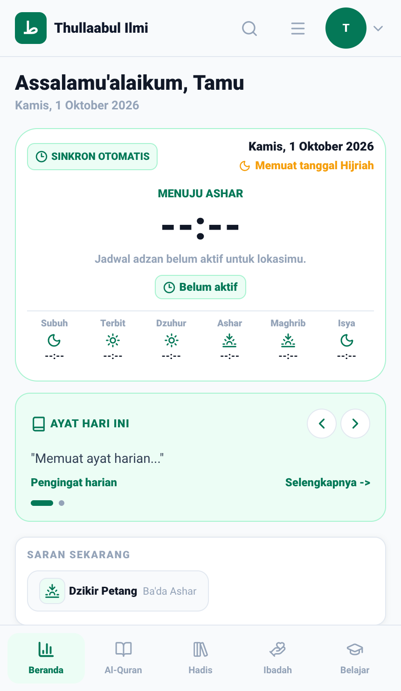 |

## 02 — Hadis > daftar kitab, dalam bahasa Indonesia (default)

Sebelumnya toggle di atas daftar kitab tertulis "Book"/"Hadith" dalam bahasa
Inggris meskipun aplikasi dalam bahasa Indonesia (default). Sekarang toggle
mengikuti `t()`: "Kitab"/"Hadis".

| Before                                                       | After                                                       |
| ------------------------------------------------------------ | ----------------------------------------------------------- |
|  | 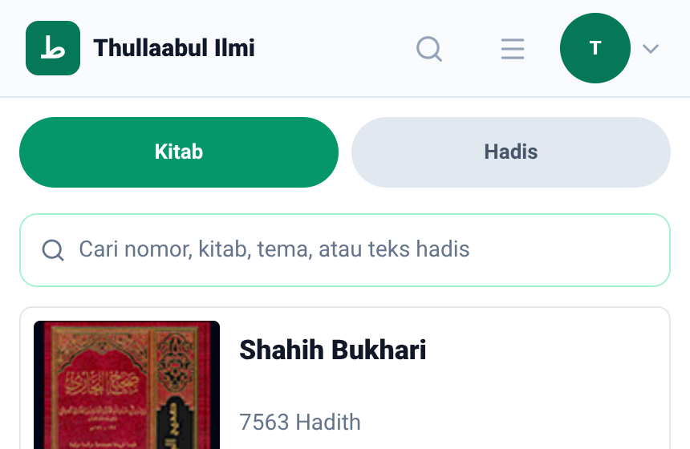 |

## 03 — Belajar hub, hero dalam bahasa Inggris

Bahasa aplikasi diganti ke English lewat menu akun. Sebelumnya hero Belajar
hub tetap berbahasa Indonesia ("KONTEN ISLAM" / "Belajar") walau tab bawah
sudah "Learn". Sekarang hero ikut `t()`: "ISLAMIC CONTENT" / "Learn".
(Catatan: judul 46 fitur di katalog seperti "Kajian"/"Artikel" masih
Indonesia — itu gap terpisah yang sengaja belum digarap, lihat dokumen
audit.)

| Before                                                       | After                                                       |
| ------------------------------------------------------------ | ----------------------------------------------------------- |
| 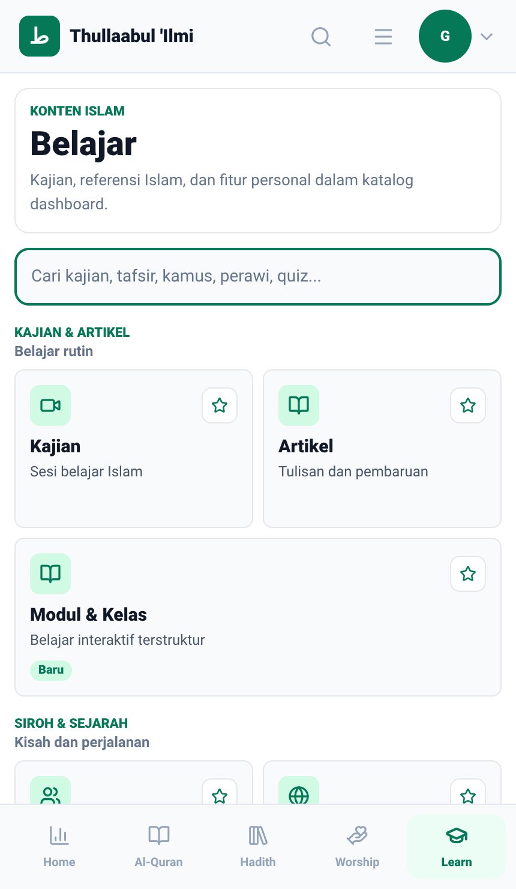 | 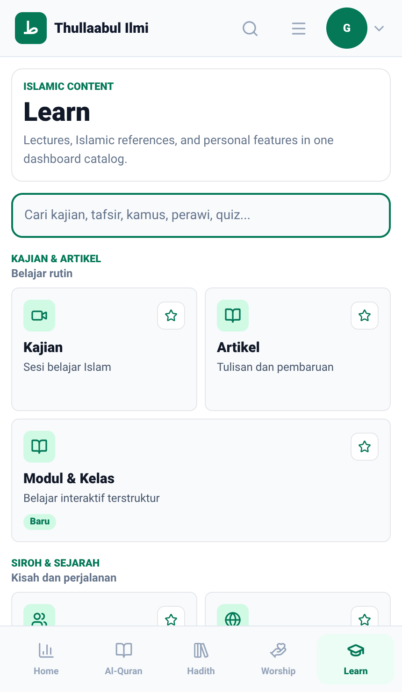 |

## 04 — Ibadah > Doa, lalu tap tab Belajar

Langkah: buka tab Ibadah → buka "Doa" (chrome menampilkan "Doa" dengan tab
Ibadah seolah aktif) → tap tab Belajar di bottom nav. Sebelumnya tab Belajar
berubah jadi highlight aktif tapi konten layar tetap menampilkan Doa (header
"Doa", daftar doa) — tab dan konten tidak sinkron. Sekarang tap yang sama
me-reset konten ke Belajar hub (hero + grid), sinkron dengan tab yang
di-highlight.

| Before                                                             | After                                                             |
| ------------------------------------------------------------------ | ----------------------------------------------------------------- |
| 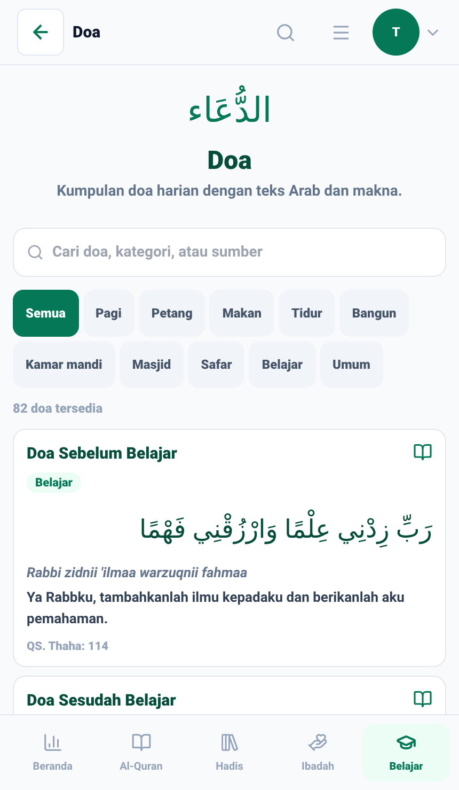 | 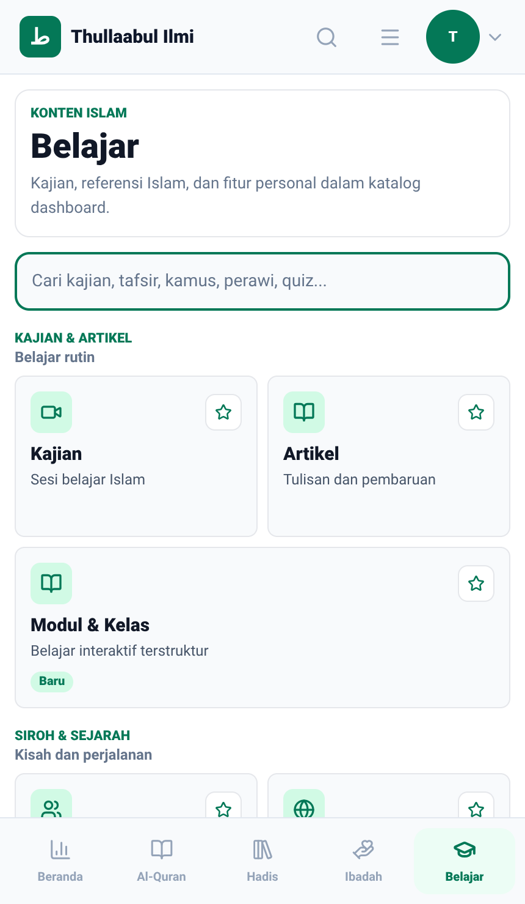 |

## 05 — Profil > Pengaturan > Tampilan, tema gelap

Tema diganti ke "Gelap" di layar yang sama. Sebelumnya label "Tema" dan
"Bahasa Konten" memakai warna teks gelap statis di atas kartu gelap —
nyaris tidak terbaca. Sekarang kedua label dapat override
`isDarkTheme && {color: colors.dark.ink}` dan terbaca jelas berwarna putih.

| Before                                                   | After                                                   |
| -------------------------------------------------------- | ------------------------------------------------------- |
| 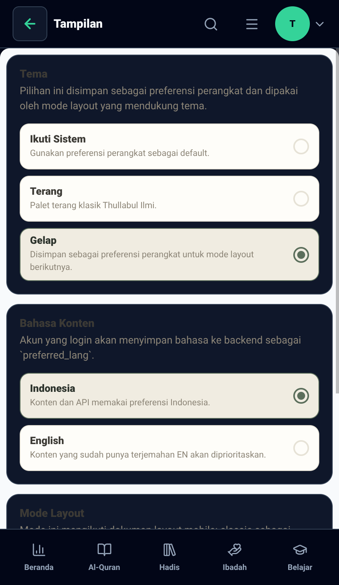 | 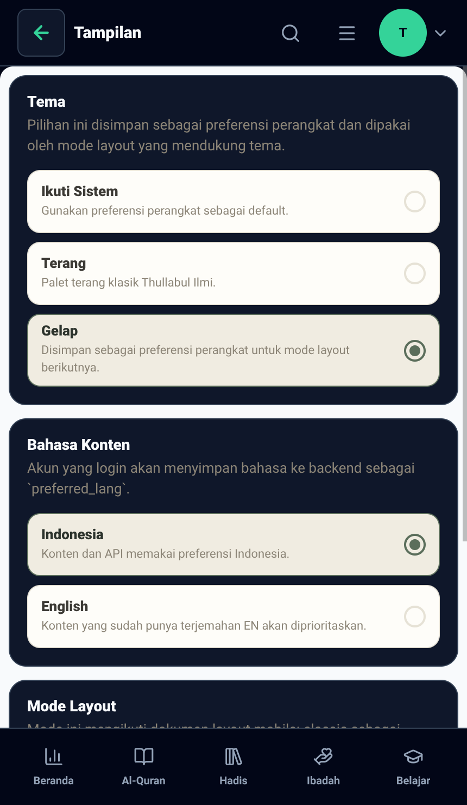 |

## 06 — Classic > Ibadah > Dzikir

Mode layout diganti ke "Classic", lalu buka Ibadah > Dzikir (bagian
"Harian"). Sebelumnya hanya daftar polos tanpa search box, tanpa chip
kategori, tanpa counter — tak ada petunjuk kalau fitur ini memang belum
lengkap. Sekarang ada search box ("Cari dzikir, sumber, atau
kategori..."), chip kategori (Semua/Pagi/Petang/Setelah Sholat/Tidur/Safar),
dan counter ("37 dzikir tersedia").

| Before                                                               | After                                                               |
| -------------------------------------------------------------------- | ------------------------------------------------------------------- |
| 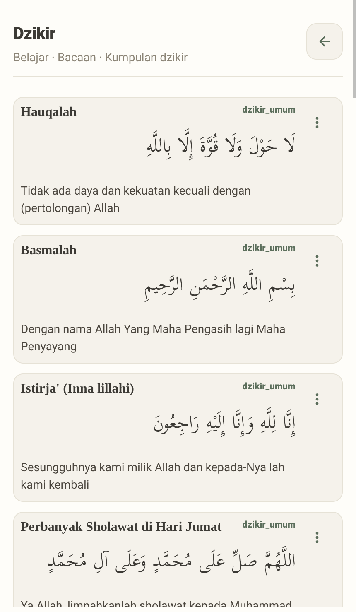 | 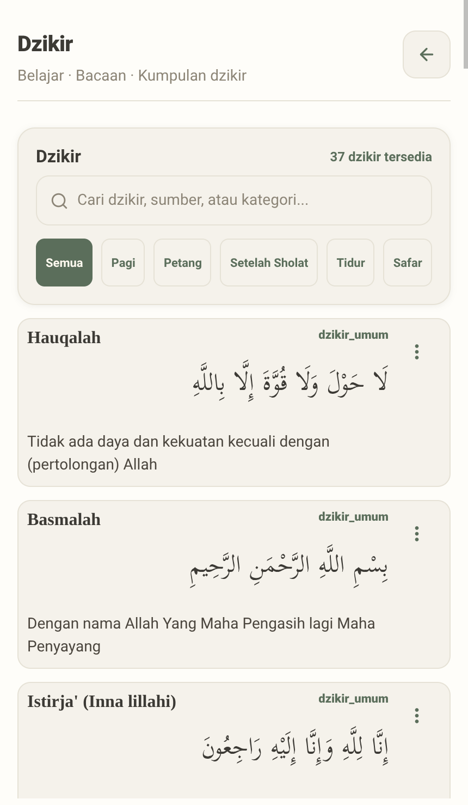 |

## 07 — Beranda > Pencarian Global

Sebelumnya membuka Pencarian Global lewat ikon kaca pembesar tidak mengubah
header sama sekali — tetap logo + nama app tanpa tombol kembali, sehingga
satu-satunya cara menutup adalah tombol back fisik perangkat. Sekarang
header menampilkan panah kembali dan judul "Pencarian" yang bisa ditekan.

| Before                                                            | After                                                            |
| ----------------------------------------------------------------- | ---------------------------------------------------------------- |
| 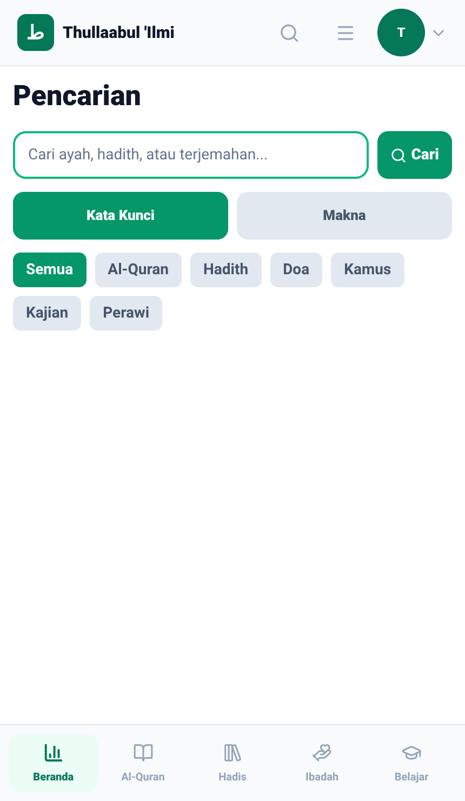 | 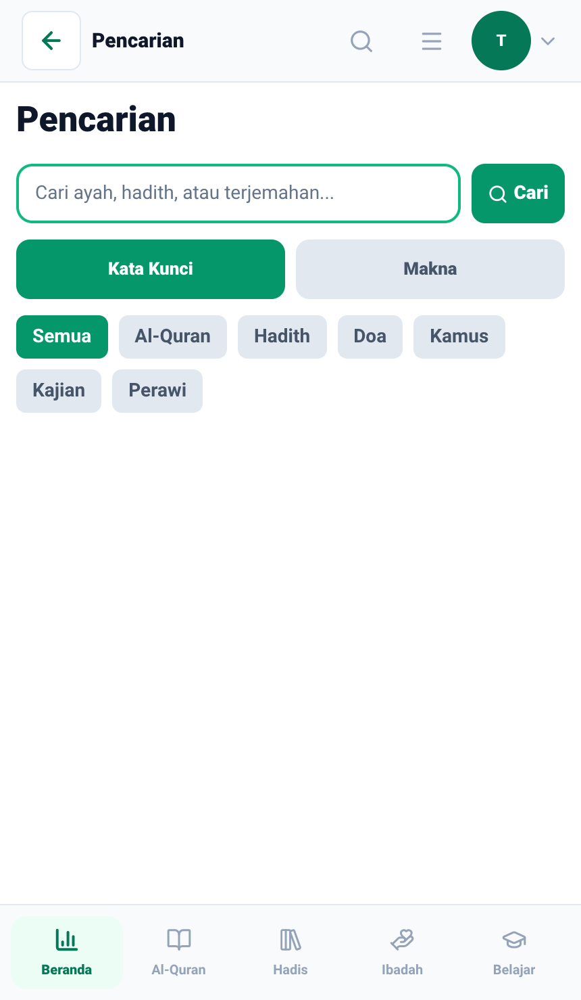 |

## 08 — Hamburger menu, grup "LAINNYA" saat di Profil > Pengaturan

Sebelumnya ketiga baris "LAINNYA" (Pengaturan/Bantuan/Tentang Aplikasi)
tersorot hijau bersamaan setiap kali berada di mana pun dalam stack Profil,
termasuk saat sedang di layar Pengaturan. Sekarang hanya baris yang sesuai
layar aktif (Pengaturan) yang tersorot.

| Before                                                              | After                                                              |
| ------------------------------------------------------------------- | ------------------------------------------------------------------ |
| 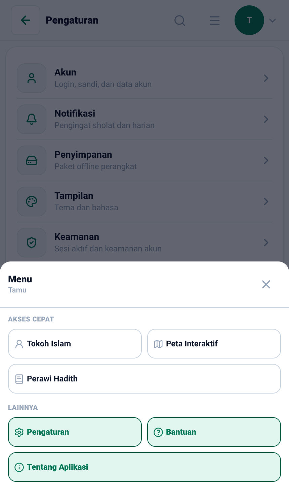 | 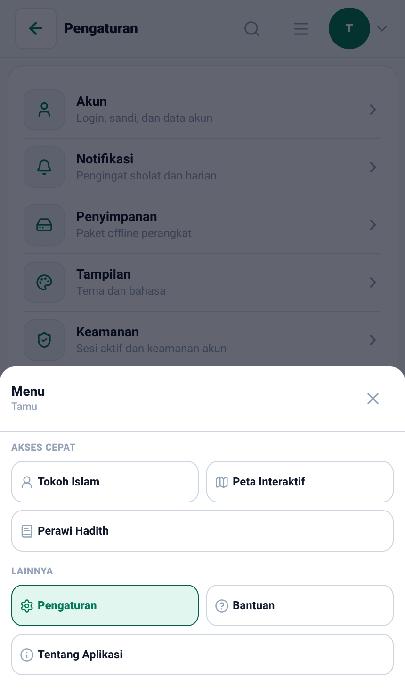 |

## Catatan

- **B12 bukan sekadar klaim** — pasangan 04 di atas membuktikan langsung
  state "nyangkut" (tab Belajar ter-highlight, konten tetap Doa) di revisi
  `before`, dan konfirmasi reset bersih di revisi `after`, lewat urutan tap
  yang identik pada kedua revisi.
- Pasangan 02, 05, dan 06 masing-masing butuh prasyarat state (bahasa
  Indonesia default/toggle tema gelap/mode layout Classic) yang diatur oleh
  `capture.js` sendiri sebelum screenshot, bukan dari pengaturan bawaan.
- Pasangan 02 di-crop ke `{width: 430, height: 280}` (hanya header + toggle
  kitab) supaya ukuran file tidak membengkak akibat gambar sampul kitab;
  pasangan lain memakai satu viewport penuh tanpa crop.
- Tidak ada login/akun pribadi yang dipakai — semua pasang memakai API
  produksi sebagai tamu (guest), konten publik.

## Cara mengambil ulang

Server Expo dan browser berjalan terlihat di depan, berhenti sendiri setelah
`capture.js` selesai. `run-with-expo.sh` sudah `cd` ke folder ekspor sebelum
menjalankan perintah, jadi path ke `capture.js` di bawah **harus absolut**
(bukan relatif seperti di contoh umum `VISUAL_EVIDENCE.md`).

```bash
scripts/before-after/export-revision.sh 95295da8 /tmp/ba-before
scripts/before-after/export-revision.sh b1af0331 /tmp/ba-after

HEADED=1 PORT=19011 LABEL=before OUT_DIR=/tmp/ba-shots \
  scripts/before-after/run-with-expo.sh /tmp/ba-before 19011 \
  node "$(pwd)/docs/media/before-after/2026-10-01-belajar-hub-code-fixes/capture.js"

HEADED=1 PORT=19012 LABEL=after OUT_DIR=/tmp/ba-shots \
  scripts/before-after/run-with-expo.sh /tmp/ba-after 19012 \
  node "$(pwd)/docs/media/before-after/2026-10-01-belajar-hub-code-fixes/capture.js"
```

Tanpa `OUT_DIR`, hasilnya menimpa gambar di folder ini. `ONLY=01,04,06`
menjalankan sebagian skenario saja (nomor di depan nama file).
