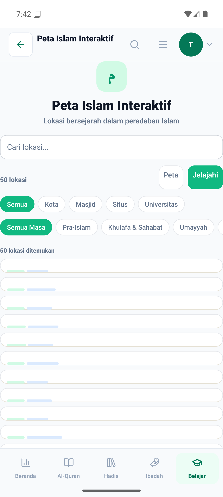
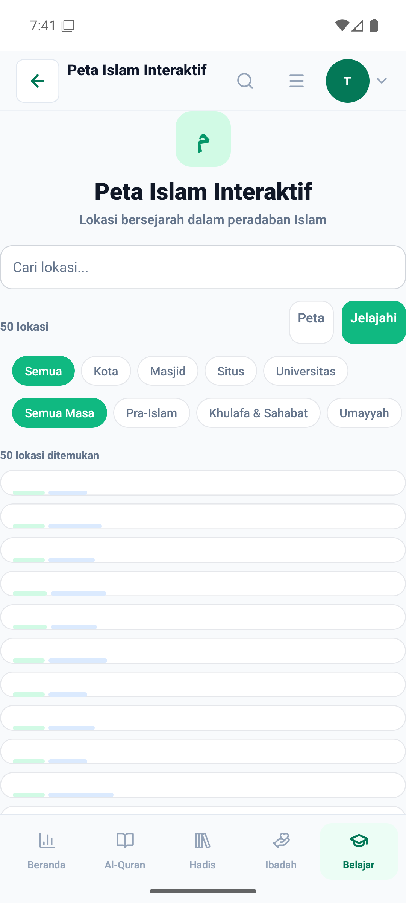
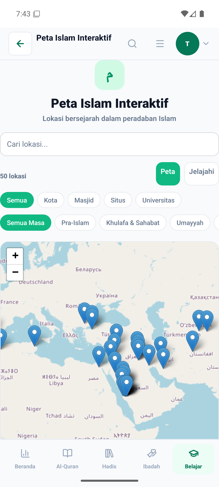
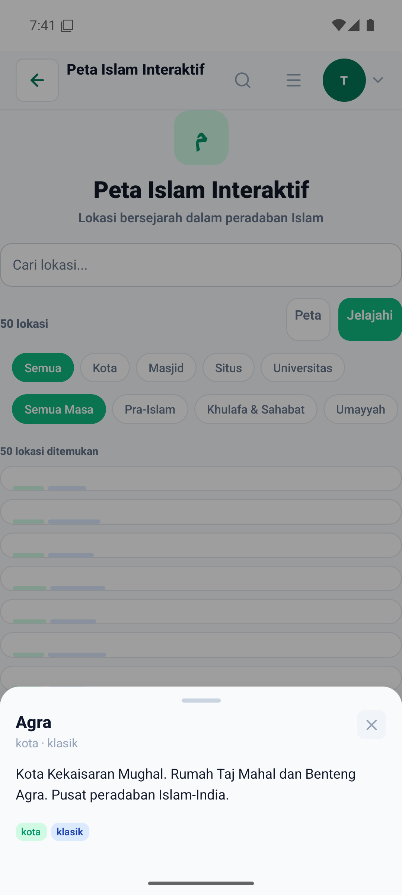

# Perbaikan UI/UX Peta Islam Interaktif (Historical Map) Mobile — Bukti Before/After

- **Topik:** Standardisasi padding filter, layout kartu lokasi, token warna tema tag badge, dan penambahan `AppModalSheet` untuk rincian lokasi peradaban Islam.
- **Sebelum:** Filter ScrollView tanpa content padding, search input warna bg salah, kartu lokasi flat tanpa batas kartu standar, tag era/kategori dengan hardcoded color, dan tap kartu beralih ke peta tanpa popup detail info.
- **Sesudah:** Filter ScrollView dengan `contentContainerStyle`, input search dengan token surface tema, baris lokasi bertransformasi menjadi card rapi, tag badge memakai token tema adaptif, dan tap kartu membuka `AppModalSheet` detail lokasi.
- **Lingkungan:** Android native emulator (1080x2400 @420dpi), tema terang.
- **Aturan yang mengikat:** [`docs/VISUAL_EVIDENCE.md`](../../../VISUAL_EVIDENCE.md)

| #   | Layar | Yang diperbaiki |
| --- | ----- | --------------- |
| 01  | Peta Islam > Daftar Lokasi | Penyelarasan padding filter, kartu lokasi, dan warna tag badge |
| 02  | Peta Islam > Detail Lokasi | Migrasi dari perpindahan peta tanpa ringkasan ke `AppModalSheet` terstandar |

## 01 — Daftar Lokasi Sejarah

Penyelarasan padding horizontal scroll chip kategori & era, token warna search input, dan token kartu lokasi.

| Before | After |
| ------ | ----- |
|  |  |

## 02 — Detail Modal Lokasi

Penambahan `AppModalSheet` untuk menampilkan deskripsi lengkap, era, dan kategori saat item ditekan.

| Before | After |
| ------ | ----- |
|  |  |
