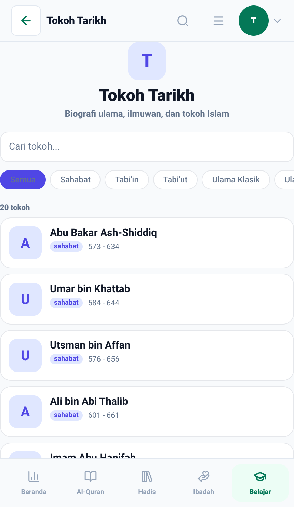
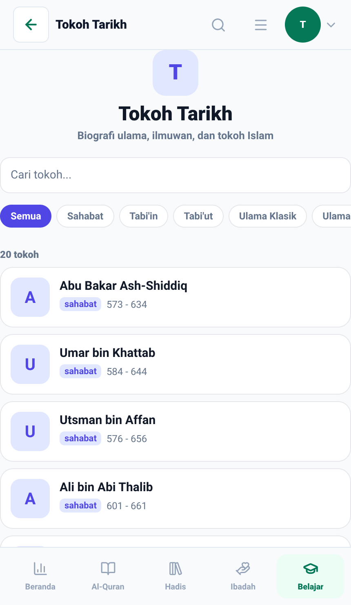
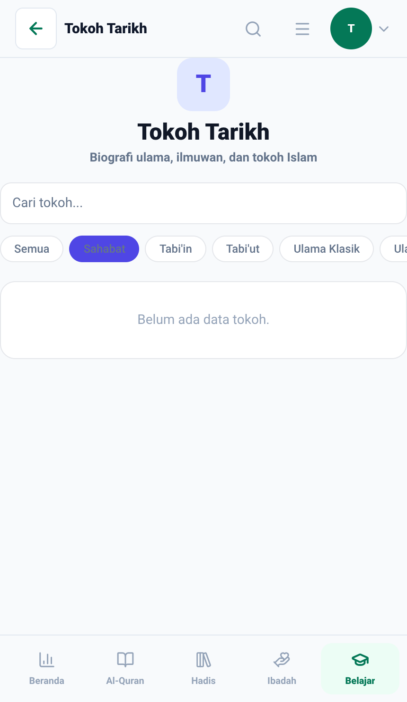
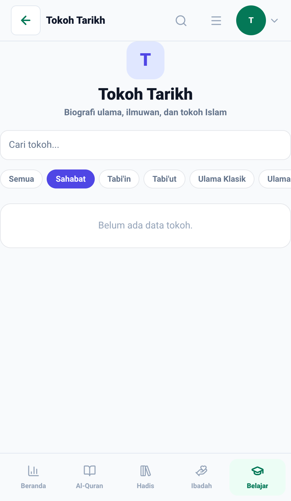

# Perbaikan UI/UX Tokoh Tarikh Mobile — Bukti Before/After

- **Topik:** Standardisasi layout Tokoh Tarikh, migrasi modal detail ke `AppModalSheet`, dan penyelarasan token tema.
- **Sebelum:** Commit `c26c7524` (modal raw `Modal`, styling hardcoded warna).
- **Sesudah:** Migrasi ke `AppModalSheet`, styling adaptif tema, token radius dan spacing konsisten.
- **Lingkungan:** Expo web export (`apps/mobile`) via Playwright, iPhone 15 Pro Max (430x750 @2x), tema terang.
- **Aturan yang mengikat:** [`docs/VISUAL_EVIDENCE.md`](../../../VISUAL_EVIDENCE.md)

| #   | Layar | Yang diperbaiki |
| --- | ----- | --------------- |
| 01  | Tokoh Tarikh > Daftar Tokoh | Penyelarasan padding, avatar, badge era, dan warna kartu |
| 02  | Tokoh Tarikh > Detail Tokoh | Migrasi dari Modal kustom ke `AppModalSheet` terstandar |

## 01 — Daftar Tokoh Tarikh

Penyelarasan avatar fallback, badge era, dan token warna kartu sesuai tema aktif.

| Before | After |
| ------ | ----- |
|  |  |

## 02 — Detail Modal Tokoh Tarikh

Penggantian `Modal` manual menjadi `AppModalSheet` dengan drag handle, rounded sheet header, dan typography yang selaras.

| Before | After |
| ------ | ----- |
|  |  |
