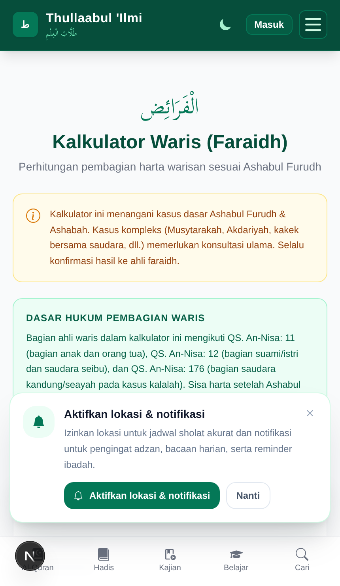
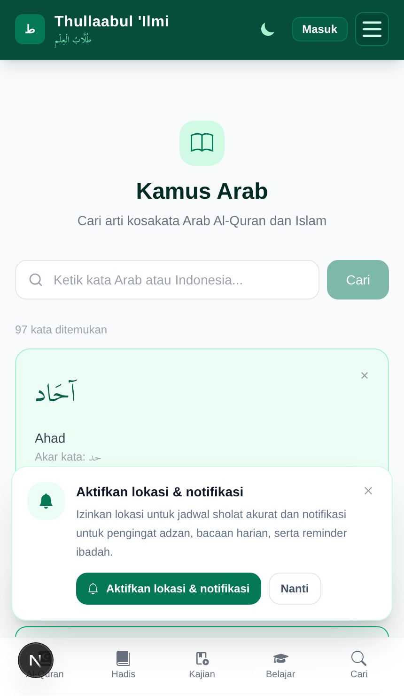
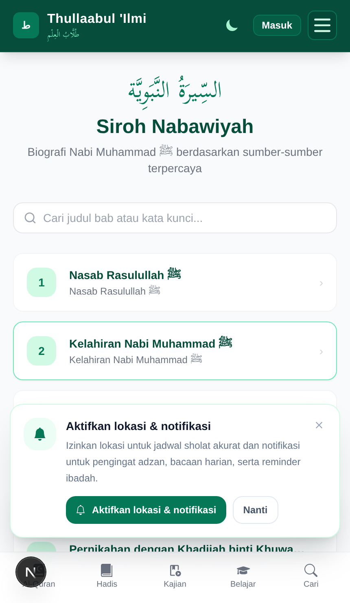

# Web UX & Page Polishing — bukti before/after

- **Sebelum:** `2e90e27e` (fix(mobile): standardize historical map layout and add detail modal)
- **Sesudah:** HEAD (fix(web): improve faraidh accessibility, kamus & siroh touch targets, and kajian video modal)
- **Lingkungan:** Web (`apps/web`) Chromium Playwright iPhone 15 Pro Max (430x739 @2x), tema terang

| #   | Layar                 | Yang diperbaiki                                                                                      | Commit |
| --- | --------------------- | ---------------------------------------------------------------------------------------------------- | ------ |
| 01  | Kalkulator Faraidh    | Duplikasi `id="page-field-1"` pada seluruh 16 input ahli waris diperbaiki ke `page-heir-${field.key}` | HEAD   |
| 02  | Kamus Arab-Indonesia  | Touch target tombol tutup kartu detail kata ditingkatkan ke standar minimum (`w-8 h-8`)              | HEAD   |
| 03  | Siroh Nabawiyah       | Touch target tombol kembali navigasi detail diperlebar (`min-h-9 px-3 py-1.5`)                       | HEAD   |

## 01 — Kalkulator Faraidh (`/faraidh`)

Sebelumnya seluruh 16 field input ahli waris memakai ID hardcoded `page-field-1` sehingga klik label mana pun hanya memfokuskan field pertama. Sekarang setiap input terikat ke ID unik ahli waris masing-masing (`page-heir-*`).

| Before | After |
| --- | --- |
|  |  |

## 02 — Kamus Arab-Indonesia (`/kamus`)

Sebelumnya tombol tutup pada kartu detail kata berupa teks polos kecil tanpa area sentuh minimum. Sekarang memiliki tombol berukuran `w-8 h-8` dengan efek hover dan aria-label yang jelas.

| Before | After |
| --- | --- |
|  |  |

## 03 — Siroh Nabawiyah (`/siroh`)

Navigasi daftar bab siroh dan tautan kembali pada halaman detail distandarisasi dengan touch target `min-h-9` dan hover state.

| Before | After |
| --- | --- |
|  |  |
