# Perbaikan B1–B10 Blog/Artikel + re-enable Catatan — bukti before/after

- **Topik:** Audit mendalam fitur Blog/Artikel (B1–B10) dan re-enable Catatan
  (Notes) via slug artikel. Lihat
  [`docs/reviews/2026-10-03-blog-deep-audit.md`](../../../reviews/2026-10-03-blog-deep-audit.md).
- **Sebelum:** `2717c551` (fix(api): note service forces ref_id/ref_slug
  exclusivity per ref_type) — commit terakhir sebelum sesi fix Blog ini mulai
  (backend agent sudah lebih dulu menambahkan dukungan `ref_slug` pada Notes
  di commit ini dan `3e3b52e7`; mobile belum menyentuhnya sama sekali).
- **Sesudah:** `4ebca457` (fix(mobile): render the item action sheet for
  Blog's Modern route (B3)) — `HEAD` saat pengambilan, mencakup dua commit
  perbaikan mobile: `7471637d` (B1–B10 + Catatan) dan `4ebca457` (perbaikan
  susulan B3 yang ditemukan saat verifikasi live sesi ini sendiri — lihat
  pesan commit).
- **Lingkungan:** Expo web export (`apps/mobile`) di Chromium lewat
  Playwright dengan jendela terlihat (`HEADED=1`), iPhone 15 Pro Max
  (430x932 @2x). **API lokal** (`localhost:29900`, `make docker-up`,
  di-rebuild ulang sesi ini supaya memuat commit backend `ref_slug` terbaru)
  diproxy dari domain produksi lewat `capture.js`, dipilih supaya artikel
  "Panduan Lengkap Sujud Tilawah" dan data hadis yang dipakai 100% konsisten
  dan reproducible antara dua revisi, dan supaya pasangan 09 (Catatan) bisa
  pakai akun nyata tanpa menyentuh data produksi. Mode layout/bahasa berbeda
  per pasang — dicatat di tabel dan tiap bagian di bawah.
- **Aturan yang mengikat:** [`docs/VISUAL_EVIDENCE.md`](../../../VISUAL_EVIDENCE.md)
- **B2 tidak punya pasangan screenshot** — lihat catatan di bagian bawah,
  diverifikasi lewat test reducer langsung sebagai gantinya.

| #   | Layar                                                     | Yang diperbaiki                                                                                                       | Commit                 |
| --- | --------------------------------------------------------- | --------------------------------------------------------------------------------------------------------------------- | ---------------------- |
| 01  | Classic > Belajar > Artikel (daftar)                      | B7: markdown mentah ("##") di kartu daftar Classic → di-strip                                                         | `7471637d`             |
| 02  | Classic > Artikel > detail (atas)                         | B4: subjudul "published" → "Admin · 3 Oktober 2026"                                                                   | `7471637d`             |
| 03  | Tap sitasi "HR. Bukhari no. 1073" dari artikel            | B1: dulu buka "Sunan Abu Daud No. 3322" (Oaths and Vows, salah total) → buka hadis yang benar                         | `7471637d`             |
| 04  | Modern > Artikel (daftar)                                 | B6: cuplikan kartu memakai awal isi penuh → excerpt API yang dikurasi                                                 | `7471637d`             |
| 05  | Modern > tap-tahan kartu artikel                          | B3: tidak ada apa pun → Aksi Cepat (Bookmark) muncul                                                                  | `7471637d`, `4ebca457` |
| 06  | Modern > Artikel > detail > "Buka sumber"                 | B5: tombol tidak melakukan apa pun → buka `thollabulilmi.site/blog/<slug>`                                            | `7471637d`             |
| 07  | Classic > Artikel > detail, Bahasa Inggris (scroll penuh) | B8: "Kembali"/"Info"/"Buka sumber" tetap Indonesia → ikut `t()`; B10: tanggal Indonesia → Inggris                     | `7471637d`             |
| 08  | Modern > Artikel (daftar + detail), Bahasa Inggris        | B9: header "Artikel" vs H1 "Islamic Articles" tidak sinkron, eyebrow "ILMU" → keduanya "Islamic Articles"/"KNOWLEDGE" | `7471637d`             |
| 09  | Artikel > detail, login sebagai admin                     | Re-enable Catatan: tombol tidak pernah ada untuk Blog → ada, bisa simpan catatan via `ref_slug`                       | `7471637d`             |

## 01 — Classic > Belajar > Artikel (daftar)

Sebelumnya setiap kartu daftar Artikel menampilkan markdown mentah ("##
Pengertian dan Hukum Sujud Tilawah", "## Titik Balik Sejarah Peradaban
Manusia") dan badge meta "published". Sekarang markdown di-strip
(`stripMarkdownText` diterapkan juga untuk `activeFeature.key === "blog"`,
sebelumnya hanya "manasik") dan meta menampilkan "Admin · 3 Oktober 2026".

| Before                                                             | After                                                             |
| ------------------------------------------------------------------ | ----------------------------------------------------------------- |
| 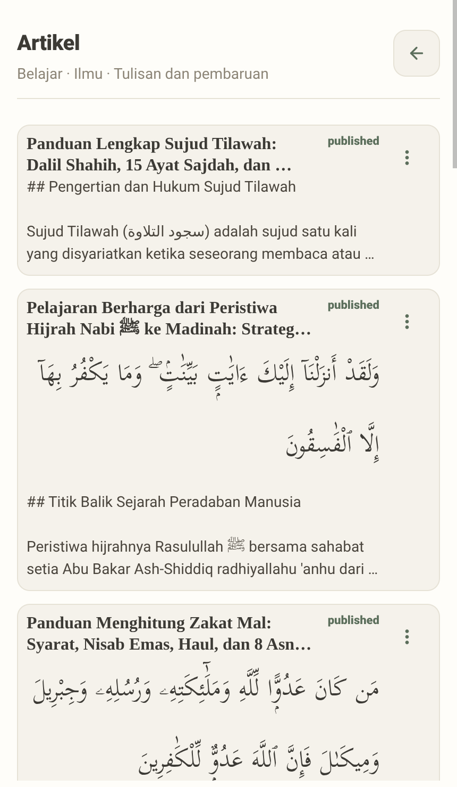 | 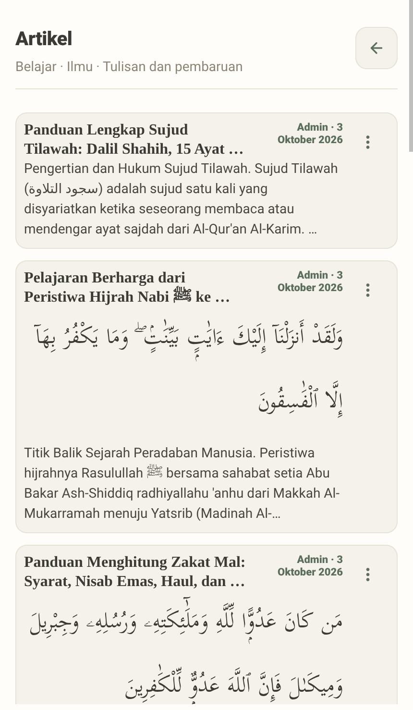 |

## 02 — Classic > Artikel > detail (bagian atas)

Sebelumnya subjudul di bawah judul artikel menampilkan string teknis backend
"published" apa adanya. Sekarang menampilkan "Admin · 3 Oktober 2026" lewat
helper `getBlogDisplayMeta` (menggabungkan `getBlogAuthor` + `formatBlogDate`
yang sudah benar di kartu daftar, tapi sebelumnya tidak dipakai di layar
detail).

| Before                                                           | After                                                           |
| ---------------------------------------------------------------- | --------------------------------------------------------------- |
| 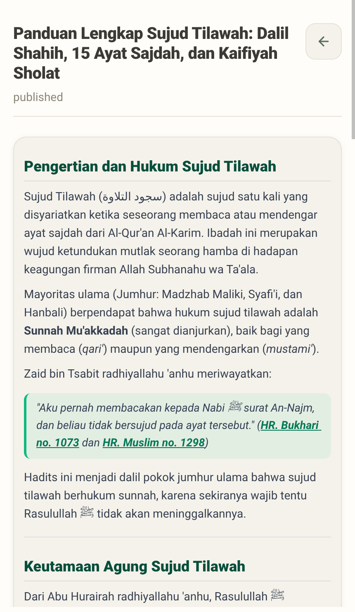 | 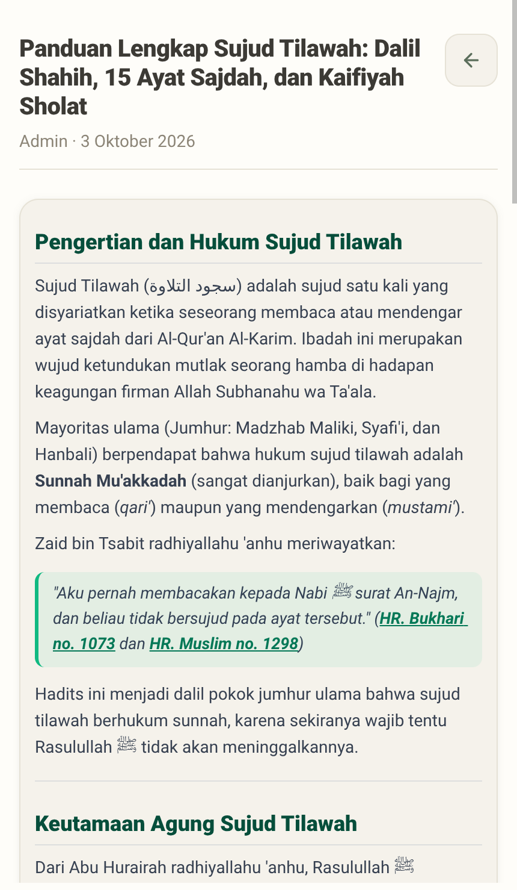 |

## 03 — Tap sitasi hadis dari dalam artikel

Artikel "Panduan Lengkap Sujud Tilawah" mengutip "HR. Bukhari no. 1073".
Sebelumnya `handleBlogLink` memperlakukan angka sitasi per-kitab (1073)
sebagai id global, dan tap link ini membuka **"Sunan Abu Daud No. 3322 —
Oaths and Vows (Kitab Al-Aiman Wa Al-Nudhur)"** — kitab dan topik yang
sama sekali tidak berhubungan dengan sitasi aslinya. Sekarang link ini
memanggil endpoint per-kitab+nomor yang benar
(`GET /hadiths/book/bukhari/number/1073`) dan membuka hadis yang benar-benar
dikutip: "Prostration During Recital of Qur'an" riwayat Zaid bin Tsabit.

| Before                                                                     | After                                                                     |
| -------------------------------------------------------------------------- | ------------------------------------------------------------------------- |
| 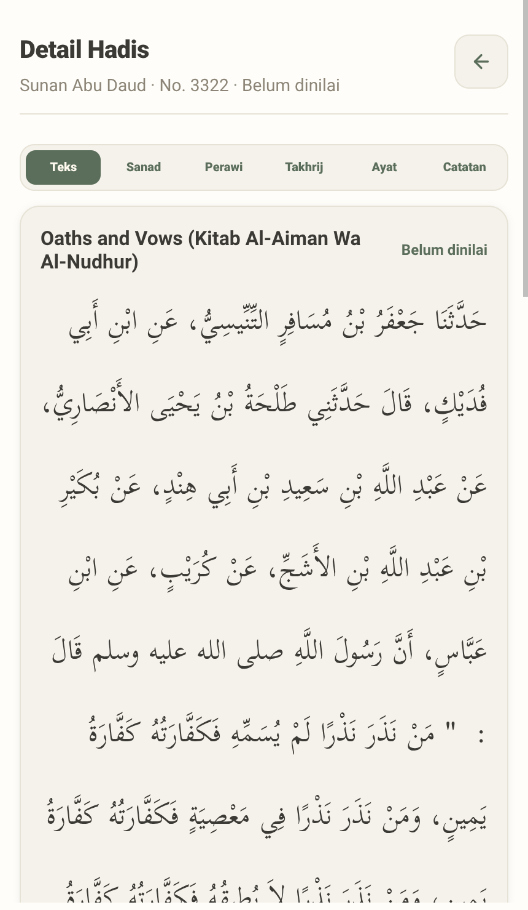 | 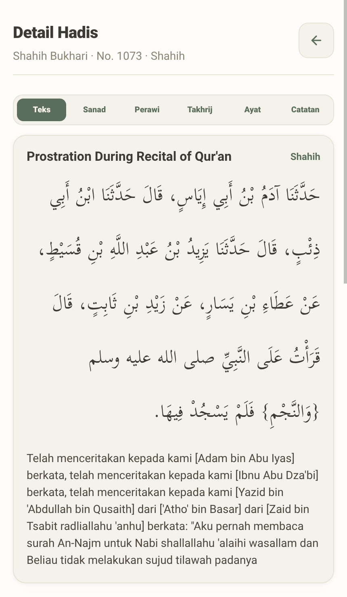 |

## 04 — Modern > Artikel (daftar)

Sebelumnya cuplikan kartu memakai awal `body` (isi artikel penuh): "Pengertian
dan Hukum Sujud Tilawah. Sujud Tilawah (سجود التلاوة) adalah sujud satu
kali...". Sekarang memakai `raw.excerpt` API yang memang ditulis khusus untuk
preview: "Penjelasan lengkap fiqh sujud tilawah: hukum jumhur ulama, daftar
15 ayat sajdah berdasarkan dalil shahih/hasan, tata cara...". (Perbaikan
kedua dari bug yang sama — body penuh bocor ke `accessibilityLabel` kartu —
tidak kelihatan di screenshot visual; diverifikasi lewat kode + tes unit.)

| Before                                                           | After                                                           |
| ---------------------------------------------------------------- | --------------------------------------------------------------- |
| 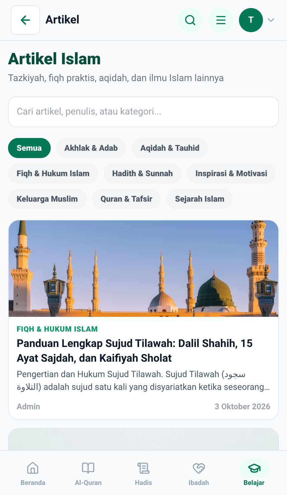 | 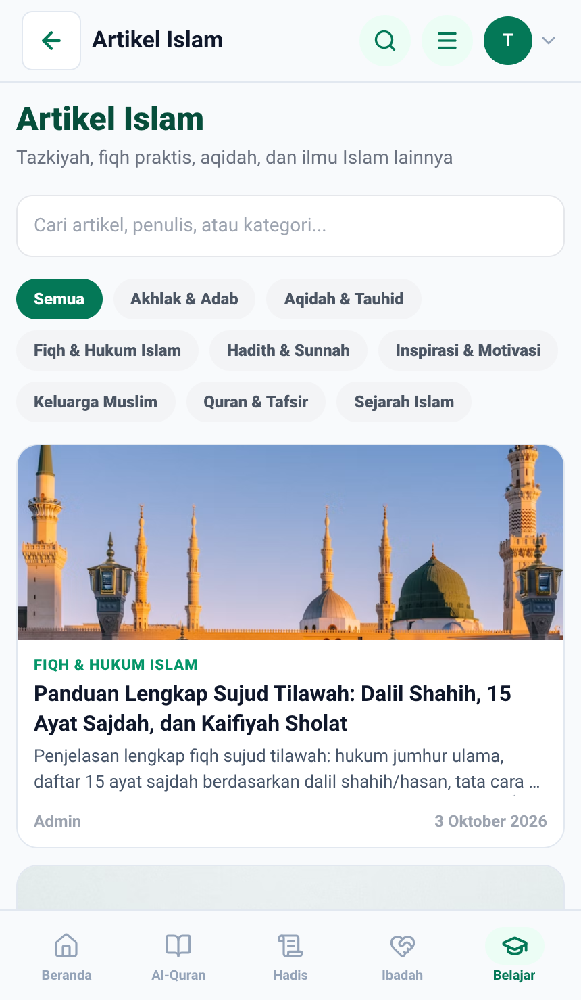 |

## 05 — Modern > tap-tahan kartu artikel

Sebelumnya `BlogCard` (Modern) tidak punya `onLongPress` sama sekali —
tap-tahan tidak memunculkan apa pun, membuat Blog satu-satunya fitur Modern
yang tidak bisa dibookmark sama sekali (dibandingkan Classic yang sudah
punya tombol "⋮"). Sekarang tap-tahan memunculkan sheet "Aksi Cepat" yang
sama dengan fitur Modern lain (Bookmark). Catatan: ini butuh dua commit —
commit pertama (`7471637d`) baru memasang `onLongPress`-nya, tapi lupa
me-render `{renderItemActionSheet()}` di route Blog (pola yang sudah dipakai
9 kali di tempat lain), jadi state berubah tapi sheet-nya tidak pernah
kelihatan; ketahuan saat verifikasi live sesi ini sendiri dan diperbaiki di
commit susulan `4ebca457`.

| Before                                                                    | After                                                                    |
| ------------------------------------------------------------------------- | ------------------------------------------------------------------------ |
|  | 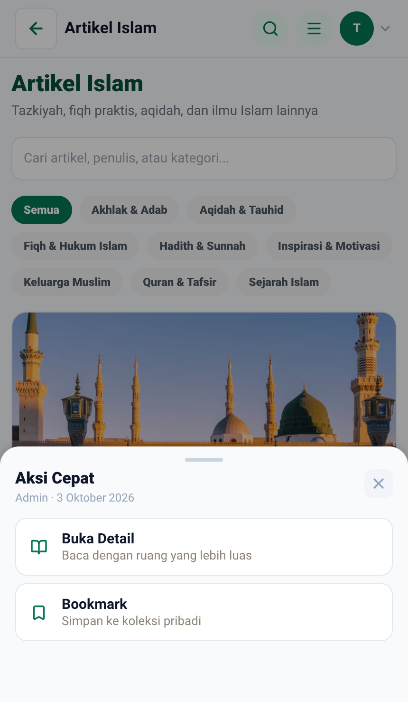 |

## 06 — Modern > Artikel > detail > "Buka sumber"

Secara visual tombolnya identik sebelum/sesudah (tidak ada state baru untuk
ditampilkan) — buktinya ada di balik layar: sebelumnya `window.open`/
`Linking.openURL` **tidak pernah dipanggil** (array kosong, lihat
`06-opened-urls-before.txt`); sekarang dipanggil dengan
`https://thollabulilmi.site/blog/panduan-lengkap-sujud-tilawah` (lihat
`06-opened-urls-after.txt`), dibangun dari `raw.slug` artikel.

| Before                                                          | After                                                          |
| --------------------------------------------------------------- | -------------------------------------------------------------- |
| 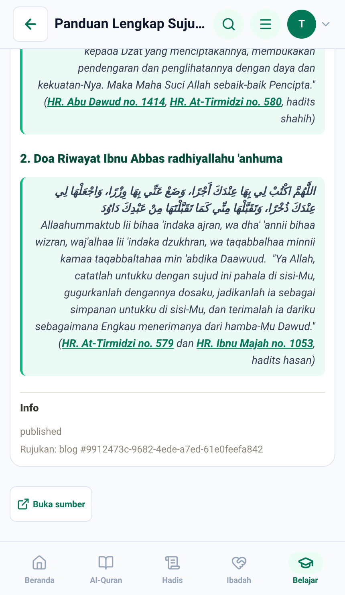 | 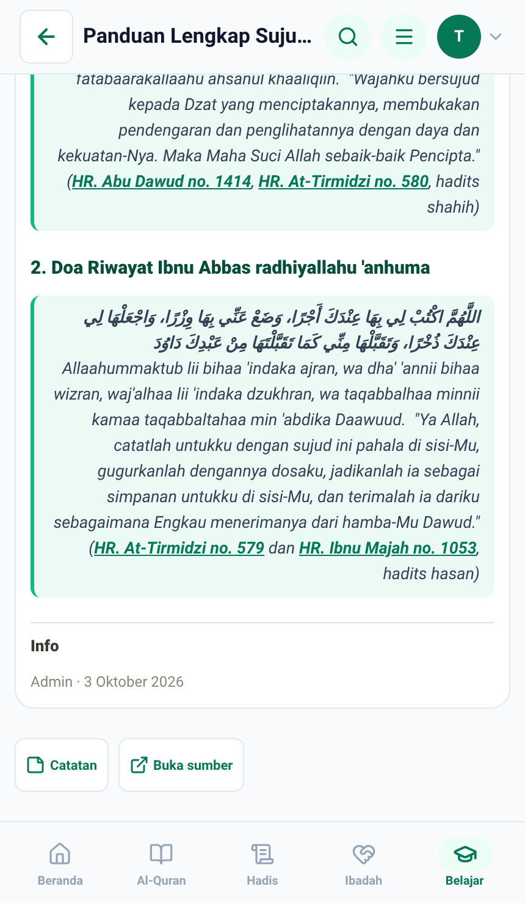 |

## 07 — Classic > Artikel > detail, Bahasa Inggris (scroll ke bawah)

Bahasa diganti ke English lewat menu akun. Sebelumnya tombol kembali tetap
"← Kembali", eyebrow grup tetap "ILMU", tombol aksi tetap "Buka sumber", dan
tanggal tetap format Indonesia ("3 Oktober 2026") — padahal bottom nav sudah
"Learn"/dsb. Sekarang: tombol kembali ikut `t()` (di Classic ikon ini
compact, labelnya jadi `accessibilityLabel` bukan teks tampil — lihat
pasangan 08 untuk bukti visual teks "Back" di Modern), panel info/"Buka
sumber" → "Open source", dan tanggal → "October 3, 2026". Baris "Rujukan:
blog #<uuid>" yang sebelumnya menampilkan UUID internal mentah ke user kini
disembunyikan untuk Blog.

| Before                                                                | After                                                                |
| --------------------------------------------------------------------- | -------------------------------------------------------------------- |
| 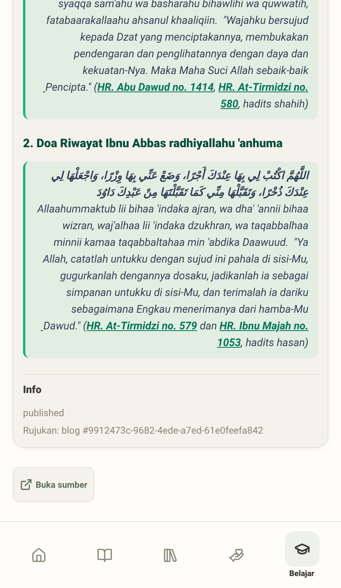 | 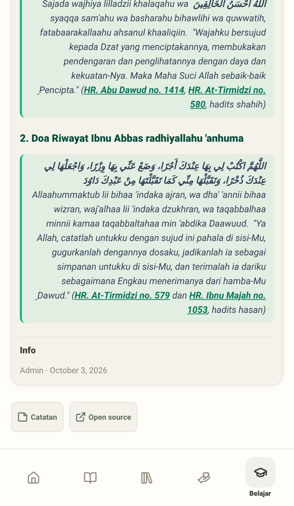 |

## 08 — Modern > Artikel (daftar + detail), Bahasa Inggris

Sebelumnya header app bar tetap "Artikel" sementara H1 di bawahnya (dan
bottom nav) sudah benar "Islamic Articles" — tidak konsisten di satu layar
yang sama. Masuk ke detail, eyebrow grup tetap "ILMU" dan tombol kembali
tetap "← Kembali" (bukan "← Back"). Sekarang header app bar ikut
`t("explore.blog.title")`, sinkron dengan H1; eyebrow grup menjadi
"KNOWLEDGE" (via `groupLabelKey` per grup fitur); tombol kembali menjadi
"← Back" (teks tampil, bukan cuma label aksesibilitas, karena di Modern
komponennya menampilkan teks). Chip kategori tetap menampilkan nama
Indonesia ("Fiqh & Hukum Islam") karena kategori ini memang tidak punya
varian `translation.en` di data backend — perilaku ini disengaja (fallback
ke Indonesia saat tidak ada terjemahan), dikonfirmasi lewat tes unit
terpisah untuk kategori yang _punya_ `translation.en`.

| Before (daftar)                                                        | After (daftar)                                                        |
| ---------------------------------------------------------------------- | --------------------------------------------------------------------- |
| 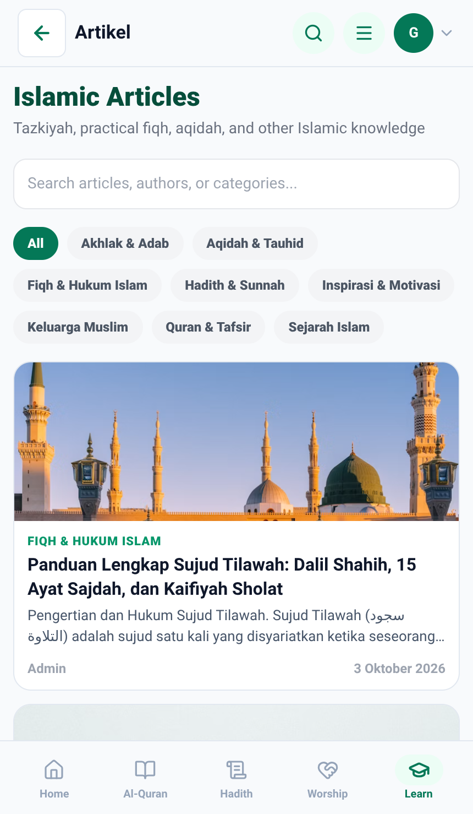 | 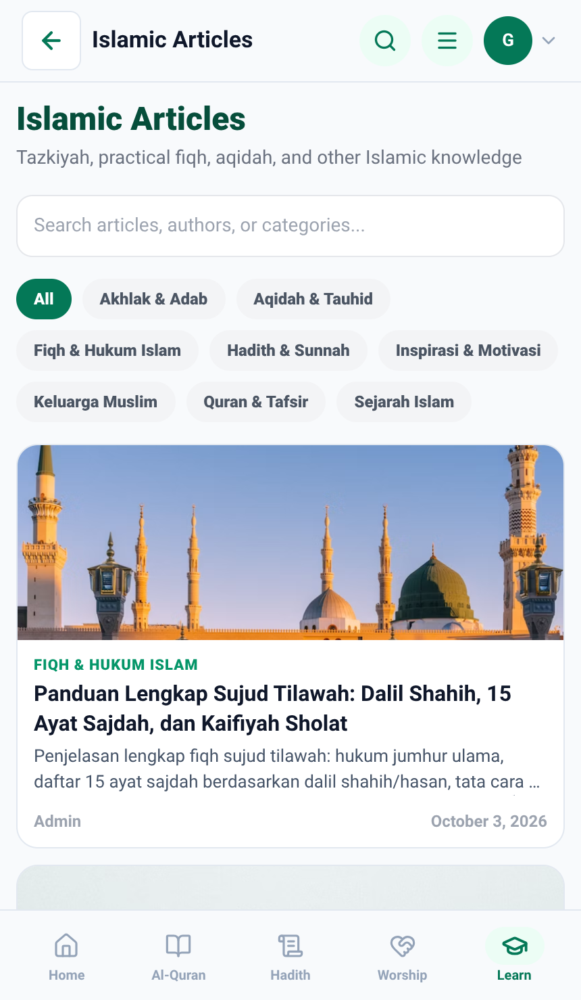 |

| Before (detail)                                                            | After (detail)                                                            |
| -------------------------------------------------------------------------- | ------------------------------------------------------------------------- |
| 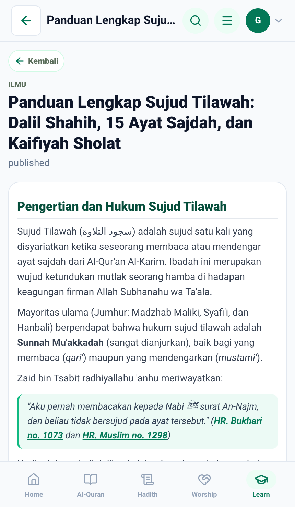 | 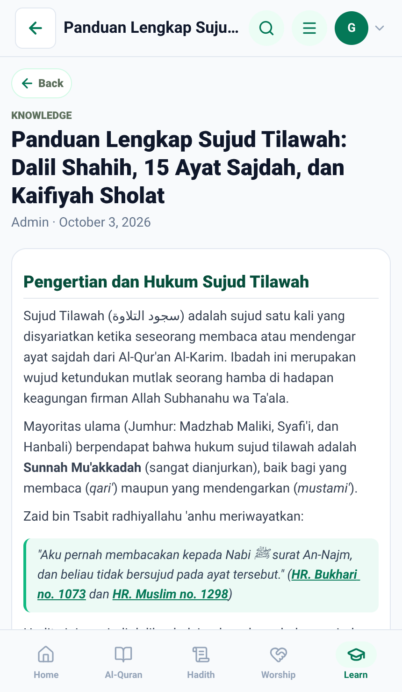 |

## 09 — Catatan (Notes) untuk artikel Blog, login sebagai admin

Backend sudah lebih dulu menambahkan dukungan `ref_type: "article"` +
`ref_slug` pada Notes (commit `3e3b52e7`/`2717c551`, paralel dengan
Bookmark yang sudah lebih dulu punya pola ini). Sebelumnya, di sisi mobile,
tombol "Catatan" **tidak pernah dirender sama sekali** untuk Blog (whitelist
`canAddNote` hanya mengizinkan `ayah/hadith/library/library_book` dengan id
numerik — Blog pakai UUID) — tidak ada kontrol untuk diklik sama sekali,
persis seperti temuan "Investigasi Khusus" di audit. Sekarang
`mobileFeatures.js` mendeklarasikan `refType: "article"` untuk Blog
(selaras dengan konvensi Bookmark), `canAddNote` punya cabang baru
(`refType === "article"` + slug tidak kosong), dan `NotesPanel`/
`createNote`/`getNotes` mengirim `ref_slug` alih-alih `ref_id` saat
tersedia. Diverifikasi end-to-end: tombol muncul, panel terbuka, menulis
dan menyimpan catatan berhasil ("✓ Berhasil — Catatan disimpan."), tersimpan
di backend lewat `ref_slug` (dikonfirmasi lewat `curl` langsung ke API
sebelum dan sesudah, serta dibersihkan lagi setelah pengambilan).

| Before (tombol tidak ada)                                     | After (tombol ada)                                           | After (catatan tersimpan)                                  |
| ------------------------------------------------------------- | ------------------------------------------------------------ | ---------------------------------------------------------- |
|  |  | 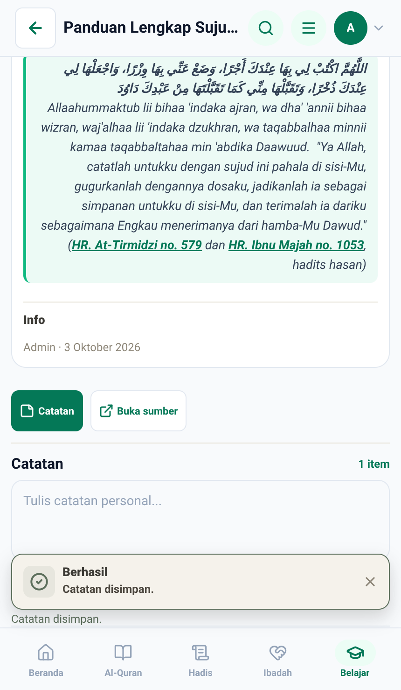 |

## Catatan tambahan

- **B2 (balik ke artikel setelah tap sitasi) tidak punya pasangan
  screenshot.** `handleBlogLink` sekarang mengirim
  `returnTo: { tab: "belajar", params: { featureKey: "blog" } }` di ketiga
  cabangnya (hadith/quran/doa), diverifikasi langsung lewat test
  (`exploreClassicRenderers.test.js`, dua test baru memeriksa persis nilai
  `onOpenTab` yang dikirim). Bukti visual penuh butuh hardware back
  sungguhan: `BackHandler.hardwareBackPress` (lihat `App.js`) tidak pernah
  terpicu di Expo web export, dan emulator `emulator-5554` yang sedang
  berjalan memakai APK release lama (terinstal sebelum sesi fix ini,
  tanpa Metro/dev client tersambung) yang tidak bisa menerima perubahan JS
  tanpa rebuild native penuh — rebuild/install ulang tidak dilakukan karena
  emulator itu kemungkinan dipakai sesi lain (lihat `AGENTS.md`/memori
  multi-agent). Assertion test langsung terhadap parameter reducer dipakai
  sebagai bukti pengganti, sesuai `VISUAL_EVIDENCE.md` butir 7 ("kutip
  keluaran teks yang membuktikan perubahan").
- Pasangan 01–08 memakai artikel publik yang sama ("Panduan Lengkap Sujud
  Tilawah", slug `panduan-lengkap-sujud-tilawah`) dan sitasi hadis yang sama
  ("HR. Bukhari no. 1073") di kedua revisi, supaya bedanya murni dari
  perubahan kode, bukan dari data yang berbeda.
- Pasangan 09 memakai akun admin seed lokal (`admin@tholabul-ilmi.com`),
  bukan akun pribadi sungguhan — password default dari
  `services/api/app/db/migrations/seeder_idempotency.go`, bukan rahasia
  produksi.
- API lokal (`localhost:29900`) di-rebuild ulang di awal sesi ini
  (`docker compose build tholabul-ilmi-api && docker compose up -d --no-deps
tholabul-ilmi-api`) supaya memuat commit backend `ref_slug` yang baru
  landed beberapa saat sebelum sesi mobile ini mulai — tanpa ini, pasangan
  09 tidak bisa diverifikasi sama sekali (container lama dimulai sebelum
  commit backend itu ada).

## Cara mengambil ulang

Server Expo dan browser berjalan terlihat di depan, berhenti sendiri setelah
`capture.js` selesai. `run-with-expo.sh` sudah `cd` ke folder ekspor sebelum
menjalankan perintah, jadi path ke `capture.js` di bawah **harus absolut**.

```bash
scripts/before-after/export-revision.sh 2717c551 /tmp/ba-before
scripts/before-after/export-revision.sh 4ebca457 /tmp/ba-after

# API lokal harus sudah jalan dan memuat commit backend ref_slug terbaru:
# docker compose build tholabul-ilmi-api && docker compose up -d --no-deps tholabul-ilmi-api

HEADED=1 PORT=19033 LABEL=before \
  DEMO_LOGIN_IDENTIFIER="admin@tholabul-ilmi.com" DEMO_LOGIN_PASSWORD="<ADMIN_PASSWORD atau default Admin@123>" \
  scripts/before-after/run-with-expo.sh /tmp/ba-before 19033 \
  node "$(pwd)/docs/media/before-after/2026-10-03-blog-audit-fixes/capture.js"

HEADED=1 PORT=19032 LABEL=after \
  DEMO_LOGIN_IDENTIFIER="admin@tholabul-ilmi.com" DEMO_LOGIN_PASSWORD="<ADMIN_PASSWORD atau default Admin@123>" \
  scripts/before-after/run-with-expo.sh /tmp/ba-after 19032 \
  node "$(pwd)/docs/media/before-after/2026-10-03-blog-audit-fixes/capture.js"
```

`ONLY=01,03,09` menjalankan sebagian skenario saja (nomor di depan nama
skenario di dalam `capture.js`). Tanpa `DEMO_LOGIN_IDENTIFIER`/
`DEMO_LOGIN_PASSWORD`, skenario 09 (Catatan) dilewati otomatis.
